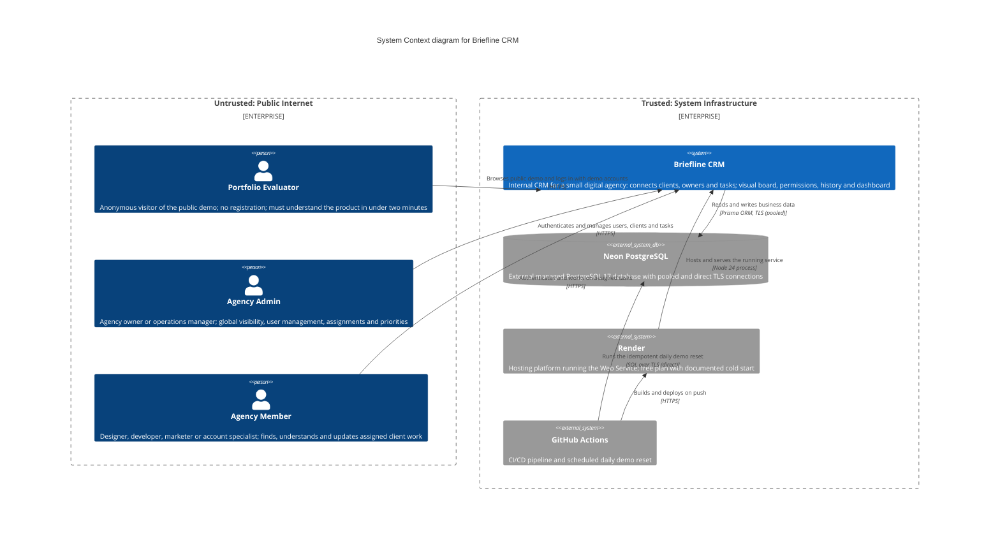
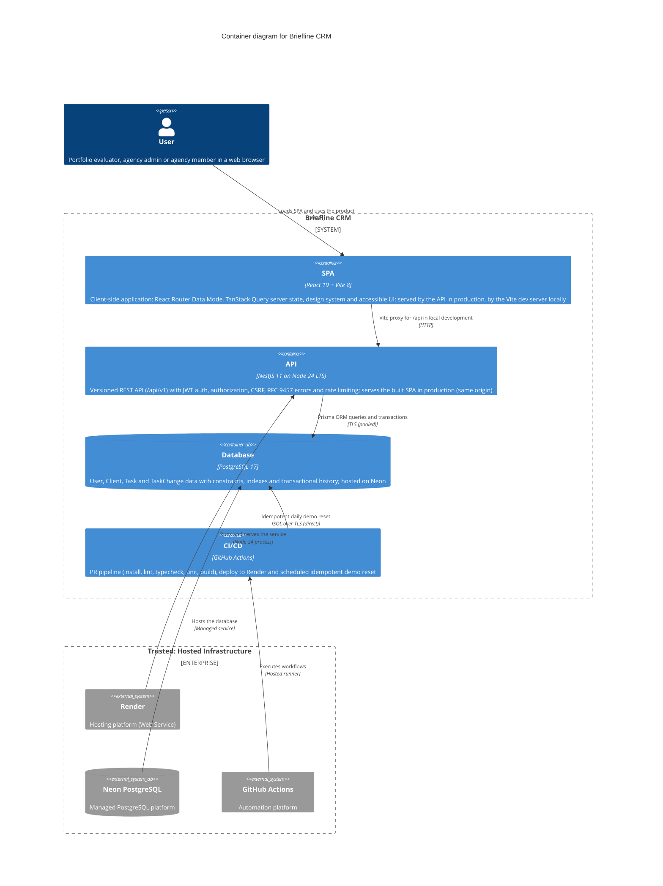
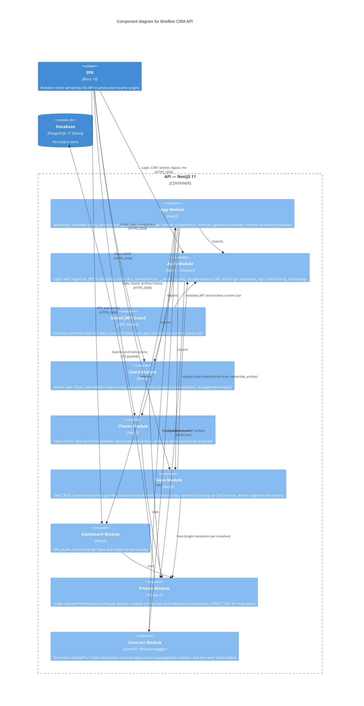

# Architecture Diagrams — Briefline CRM
**Date:** 2026-08-11
**Status:** PH-01 Draft

## C4 Level 1: System Context

### Description

Briefline CRM is the central system: a same-origin web application composed of a React SPA and a NestJS API that share one PostgreSQL database. Three human actors interact with it through their web browsers:

- **Portfolio Evaluator** — an anonymous visitor who reaches the public demo without registration, logs in with highlighted demo accounts (administrator and member), and evaluates the product. Demo data (`Northstar Digital Studio`: 8 users, 12 clients, 36 tasks) is fictional and restored by a daily reset.
- **Agency Admin** — authenticated owner or operations manager with global visibility and control over users, clients, and tasks.
- **Agency Member** — authenticated team member who works on assigned client work.

External systems:

- **Neon PostgreSQL** — the managed database. The API connects through Prisma with a pooled connection; migrations and the daily reset use a direct connection. TLS is required.
- **Render** — hosting platform that runs the single Web Service (SPA + API, Node 24). Free plan imposes a documented 30–60 s cold start.
- **GitHub Actions** — runs the PR pipeline (install, lint, typecheck, tests, build), deploys to Render on push, and executes the scheduled idempotent demo reset directly against Neon. There is no public destructive reset endpoint (DEC-038).

Trust boundaries: all human access originates from the **untrusted public internet** (HTTPS only); the system itself, its database, hosting, and automation live inside the **trusted system infrastructure**. The API never exposes secrets, stacks, or SQL details, and all cross-boundary traffic is TLS-encrypted.

## C4 Level 2: Container

### Description

Briefline CRM consists of four containers:

- **SPA** (React 19 + Vite 8) — the client-side application. In production it is served by the API as static assets (same origin, DEC-036); in local development it runs on the Vite dev server, which proxies `/api` to the API container.
- **API** (NestJS 11 on Node 24 LTS) — the application container. Exposes the versioned REST API under `/api/v1`, enforces authentication and authorization, and serves the SPA in production. Same-origin production removes CORS entirely and makes `HttpOnly` session cookies safe.
- **Database** (PostgreSQL 17 on Neon) — the data container. Holds `User`, `Client`, `Task`, and `TaskChange` with constraints and query-driven indexes. Runtime access uses the pooled URL with a low Prisma `connection_limit`; migrations use `DIRECT_URL`.
- **CI/CD** (GitHub Actions) — the automation container. Runs the PR pipeline, deploys the unified build to Render, and executes the daily demo reset via a short-lived direct connection to the database (no pooler needed for a single reset connection).

Trust boundaries: the **browser is untrusted** — it only receives validated JSON, static assets, and an `HttpOnly` session cookie, and it never sees secrets. Everything inside the system boundary is **trusted**: the API is the only component that touches the database with business logic, and the CI/CD container is the only component allowed to mutate data outside the API (the idempotent reset). Render and Neon are external managed platforms inside the trusted infrastructure zone; the Web Service filesystem is ephemeral, so all persistent state lives in Neon.

## C4 Level 3: Component — NestJS API

### Description

The API is a NestJS 11 modular monolith. **App Module** bootstraps the application (validated config, strict `ValidationPipe`, helmet, compression, throttler, graceful shutdown) and imports the feature modules. Feature modules expose versioned controllers under `/api/v1`, and all of them depend on the **Prisma Module** for data access.

| Module | Key packages / APIs | Patterns and rules |
|---|---|---|
| App Module | `@nestjs/config`, `class-validator`, `class-transformer`, `helmet`, `compression`, `@nestjs/throttler`, `@nestjs/serve-static` | Validated env config; DTOs reject unexpected properties (NFR-SEC-005); SPA served in production |
| Auth Module | `@nestjs/jwt`, `@nestjs/passport`, `passport-jwt`, `argon2`, `csrf-csrf`, `cookie-parser`, `@nestjs/throttler` | HS256 JWT in 8 h HttpOnly cookie, `iss`/`aud` fixed, SameSite=Lax and `__Host-` in prod (DEC-032); double-submit CSRF + Origin validation; Argon2id (19 MiB, 2 iterations, parallelism 1); login rate limited |
| Global JWT Guard | `APP_GUARD` + `@Public()` | Secure-by-default: every route authenticated; current user must remain active (BR-001) |
| Users Module | Prisma, `argon2` (initial password) | Admin only; case-insensitive unique email; serializable last-active-admin protection (BR-003); reassignment impact (FR-USR-005) |
| Clients Module | Prisma | Any active user creates; admin edits/archives (BR-006); field-level allowlist; archived client rejects new associations (BR-005, FR-CLI-006) |
| Tasks Module | Prisma interactive transactions | `Task.version` optimistic locking with `expectedVersion` (409 on stale writes); atomic mutation + append-only `TaskChange` history (BR-017/018); status rules BR-007–016 |
| Dashboard Module | Prisma | Aggregated KPIs, prioritized My Tasks, visible-only activity (FR-DASH) |
| Prisma Module | `@prisma/client` 7 | Single `PrismaService` lifecycle (DB-001); pooled runtime URL (`connection_limit` 5–10); `DIRECT_URL` only for migrations |
| Contract Module | `@nestjs/swagger`, `packages/api-contract` | OpenAPI v1 generated from decorators; types generated and never hand-edited (DEC-031); RFC 9457 catalogue |

Cross-cutting behavior: **Global JWT Guard** (registered via `APP_GUARD`) applies to every route; the **Problem Details** layer converts errors to `application/problem+json` with domain `code` and `traceId` (RFC 9457, DEC-033) without leaking stacks, SQL, or secrets. Task mutations and their history entries commit in one transaction, and authorization reads, mutation, and history all share that transaction (NFR-REL-001). Contract generation is build-time only: the OpenAPI artifact and generated types are the integration boundary for the SPA.

## C4 Level 3: Component — React SPA

```mermaid
C4Component
  title Component diagram for Briefline CRM SPA

  Container(api, "API", "NestJS 11", "Versioned REST API, same origin")

  Container_Boundary(spa, "SPA — React 19 + Vite 8") {
    Component(providers, "Providers", "React", "QueryClientProvider (TanStack Query), ErrorBoundary and AuthProvider mounted once; single source of server state")
    Component(router, "Router", "React Router 7 (Data Mode)", "Created outside render; routes: /login, /dashboard, /board, /tasks/:taskId, /clients, /clients/:clientId, /users, /profile, /403, /404")
    Component(pageLogin, "Login Page", "React", "Demo account fill, generic errors, rate-limit feedback")
    Component(pageDashboard, "Dashboard Page", "React", "KPI cards, prioritized My Tasks, recent activity; deep links to filtered views")
    Component(pageBoard, "Board Page", "React", "Backlog and active columns, filters and search, accessible Move-to control plus drag-and-drop, optimistic updates")
    Component(pageTaskDetail, "Task Detail", "React", "Routed side panel (desktop) or full-screen modal (mobile); edit and append-only history timeline")
    Component(pageClients, "Clients Page", "React", "Search, status filter, pagination and create")
    Component(pageClientDetail, "Client Detail", "React", "Client data, related tasks and archive state")
    Component(pageUsers, "Users Page", "React", "Admin only; list, create, role and status, reassignment impact")
    Component(pageProfile, "Profile Page", "React", "Read and update own name")
    Component(hooks, "Hooks", "TanStack Query 5 + RHF + Zod", "Queries and mutations, optimistic cache updates with rollback, form pattern, auth session state")
    Component(apiClient, "API Client", "fetch + OpenAPI types", "Sends cookies and CSRF header, AbortSignal, maps RFC 9457 problem details, handles 401/403/409/429")
    Component(designSystem, "Design System", "Tokens + primitives", "Type, color, spacing, radius, elevation and motion tokens; Button, Field, Select, Badge, Card, Table, Skeleton, Alert, Empty, Error, Drawer, Dialog")
  }

  Rel(providers, router, "Wraps with server state, error and auth context")
  Rel(router, pageLogin, "Route: /login")
  Rel(router, pageDashboard, "Route: /dashboard")
  Rel(router, pageBoard, "Route: /board")
  Rel(router, pageTaskDetail, "Route: /tasks/:taskId")
  Rel(router, pageClients, "Route: /clients")
  Rel(router, pageClientDetail, "Route: /clients/:clientId")
  Rel(router, pageUsers, "Route: /users (admin)")
  Rel(router, pageProfile, "Route: /profile")

  Rel(pageLogin, hooks, "Auth queries and mutations")
  Rel(pageDashboard, hooks, "KPI, My Tasks and activity queries")
  Rel(pageBoard, hooks, "Board query and optimistic status mutations")
  Rel(pageTaskDetail, hooks, "Task and history queries and mutations")
  Rel(pageClients, hooks, "Client queries and mutations")
  Rel(pageClientDetail, hooks, "Client detail query and mutations")
  Rel(pageUsers, hooks, "User queries and mutations")
  Rel(pageProfile, hooks, "Profile query and mutation")

  Rel(pageLogin, designSystem, "Composes primitives")
  Rel(pageDashboard, designSystem, "Composes primitives")
  Rel(pageBoard, designSystem, "Composes primitives")
  Rel(pageTaskDetail, designSystem, "Composes primitives")
  Rel(pageClients, designSystem, "Composes primitives")
  Rel(pageClientDetail, designSystem, "Composes primitives")
  Rel(pageUsers, designSystem, "Composes primitives")
  Rel(pageProfile, designSystem, "Composes primitives")

  Rel(hooks, apiClient, "Invokes")
  Rel(apiClient, api, "REST calls, same origin", "HTTPS, JSON")

  UpdateRelStyle(router, pageLogin, $offsetX="-120")
  UpdateRelStyle(router, pageBoard, $offsetX="-60", $offsetY="20")
  UpdateRelStyle(router, pageUsers, $offsetY="-20")
  UpdateRelStyle(pageBoard, hooks, $offsetY="-20")
  UpdateRelStyle(pageTaskDetail, hooks, $offsetY="-10")
  UpdateRelStyle(hooks, apiClient, $offsetY="-20")

  UpdateLayoutConfig($c4ShapeInRow="4", $c4BoundaryInRow="1")
```

### Description

The SPA is a React 19 single-page application structured around four responsibilities:

- **Router** (React Router 7 in Data Mode) — created outside render (FE-002), defines all product routes (`/login`, `/dashboard`, `/board`, `/tasks/:taskId`, `/clients`, `/clients/:clientId`, `/users`, `/profile`) plus `/403` and `/404`. Deep links and browser navigation stay coherent; every screen includes loading, empty, error, and forbidden states.
- **Providers** — mounted once: `QueryClientProvider` (TanStack Query v5, single source of server state), an `ErrorBoundary`, and the `AuthProvider` that boots the session on reload, clears session and cache on 401, and treats 403 as a permission error, not a logout.
- **Pages** — feature screens that only compose primitives and call hooks. The board uses accessible permanent `Move to…` controls as the primary path with drag-and-drop as progressive enhancement, plus optimistic mutations with rollback and a one-pending-move-per-task concurrency guard (FR-TASK-012, NFR-REL-002).
- **Shared** — the **API Client** (fetch wrapper typed from the generated OpenAPI types: sends cookies and the CSRF header, supports `AbortSignal`, maps RFC 9457 problem details, and handles 401/403/409/429), the **Design System** (documented tokens and semantic primitives), and **Hooks** (queries/mutations, optimistic updates, and the react-hook-form + Zod form pattern).

Data flows from pages to hooks, from hooks to the API client, and from the API client to the backend over same-origin HTTPS with the session cookie; the UI never holds the authority — server-enforced permissions decide what is rendered as interactive, read-only, or forbidden.

## Trust Boundaries

| Boundary | Description | Security Controls |
|---|---|---|
| Internet ↔ Render | Public traffic to the deployed service | HTTPS only, TLS termination at Render, `Secure` session cookie, helmet security headers and CSP |
| Browser ↔ API | REST API and session exchange | JWT in HttpOnly cookie (8 h, SameSite=Lax, `__Host-` name in production), double-submit CSRF + Origin validation for unsafe methods, login rate limiting (429 is contractual) |
| API ↔ Database | Prisma connections to Neon | TLS required (`sslmode=require`), pooled runtime URL with low `connection_limit`, direct URL only for migrations and the reset script; credential-based auth (Neon does not offer IP allowlisting — verified in devops-platform-validation) |
| GitHub Actions ↔ Neon | Daily demo reset | `DATABASE_URL`/`RESET_URL` stored only as GitHub secrets, short-lived single direct connection, idempotent script with `concurrency` guard, no public destructive endpoint (DEC-038) |
| GitHub Actions ↔ Render | Build and deploy on push | HTTPS deploy with scoped credentials stored in GitHub secrets, health check gate (`/api/health` returns 200 only when the DB is reachable), automatic rollback on failed health window |

## Key Design Decisions

- **Same-origin production:** the SPA is served by NestJS (`ServeStaticModule`), so no CORS configuration is needed and `HttpOnly` session cookies are safe (DEC-036).
- **Contract-first:** OpenAPI lives in `packages/api-contract`; types are generated from it and are never hand-edited; mocks and fixtures derive from the approved examples (DEC-031).
- **Secure-by-default:** `APP_GUARD` authenticates every route; `@Public()` is the explicit exception; the current user must remain active on every request.
- **Server-enforced permissions:** the UI is never the authority — every operation is authorized by role, object relationship, and state (BR-006/013/014/015).
- **Session without refresh:** JWT in an 8 h `HttpOnly` cookie, `SameSite=Lax`, `Secure` and `__Host-` in production, double-submit CSRF — no Web Storage tokens (DEC-032).
- **Concurrency and audit:** `Task.version` optimistic locking with `expectedVersion` (409 on stale writes) and atomic append-only `TaskChange` history inside one transaction (DEC-034, NFR-REL-001).
- **Versioned and constrained API:** `/api/v1` prefix, RFC 9457 `application/problem+json` errors with domain `code` and `traceId`, strict DTOs that reject unexpected properties (DEC-033, NFR-SEC-005).
- **Single database client:** one injected `PrismaService` lifecycle, pooled runtime connection, `DIRECT_URL` only for migrations and the reset (DB-001, devops-platform-validation).
- **Recoverable demo:** the daily reset runs from GitHub Actions against the database with an idempotent script; there is no public destructive endpoint (DEC-038).
