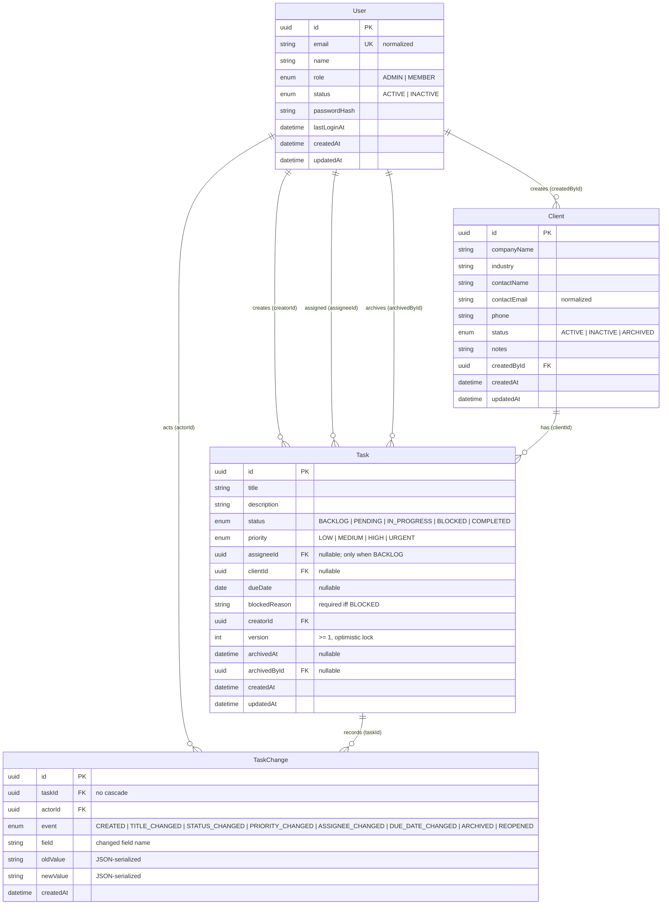

# Data Model — Briefline CRM

**Date:** 2026-08-11
**Status:** PH-01 Draft (DATA-001)
**Owner:** ARCH/BE
**References:** PRD §11–12, §17 (02-prd.en.md); ADR-001–005 (adrs.md); Permission Matrix (permission-matrix.md); Development Plan PH-03 (DB-001–008), PH-04 (USR-005), PH-06 (TASK-API-001–014); Consolidated API Baseline §1.2.4 / CR-08 (Prisma 7); Backend API Verification §3
**Replaces:** the prototype `RefreshToken`-era schema sketch in backend-api-verification.md §3 (superseded by this document)
**Input for:** PH-03 DB-002 (schema), DB-003 (initial migration), DB-004 (indexes), DB-005 (seed), DB-007 (row-local integrity tests)

## 0. Design decisions (resolution of ambiguities)

| # | Decision | Rationale |
|---|---|---|
| D-1 | Generator `provider = "prisma-client"` (Prisma 7.9.1), **no** `prisma-client-js`, **no** `previewFeatures = ["driverAdapters"]` | Consolidated Baseline §1.2.4/CR-08 + Backend Verification §3: Prisma 7 requires the new Rust-free client, mandatory `output`, and the `@prisma/adapter-pg` driver adapter as the *only* PostgreSQL path — driver adapters are no longer a preview feature in v7 |
| D-2 | All technical timestamps use explicit `@db.Timestamptz(6)` | Prisma's default PostgreSQL mapping for `DateTime` is `timestamp(3) without time zone`. ADR-003 mandates `timestamptz` (UTC absolute instants). The explicit annotation removes any ambiguity — the generated migration will contain `timestamptz(6)` |
| D-3 | `Task.dueDate` as `DateTime? @db.Date` | ADR-003 / BR-019-020: date-only deadlines, serialized `YYYY-MM-DD`, overdue evaluated against Europe/Madrid at query time (never stored) |
| D-4 | No user timezone column | ADR-003: single-timezone demo (Europe/Madrid); deliberately out of scope |
| D-5 | `Task.version Int @default(1)`, no `TaskChange.version` column | ADR-004.7 says each TaskChange "carries the new post-mutation version number". DATA-001 keeps TaskChange minimal per spec: the version is derivable (CREATED ⇒ 1; events ordered by `createdAt` ⇒ 2..N; `Task.version = count(TaskChange of that task)` — the seed enforces this invariant). If timeline reconstruction *by version* is ever required, add the column in a PH-14 migration. Flagged for PH-14 review |
| D-6 | Referential actions: `Restrict` on every FK that guards history/ownership; `SetNull` only on `Task.assigneeId` | "No cascade that erases history" (PH-03 guard, AP-07 family). Users/Clients are never physically deleted (deactivation/archival are the app's terminal states, PRD §8), so Restrict is a pure backstop. `assigneeId` is the only FK whose value legitimately changes to null in app logic (backlog, BR-008) and the only one using SetNull so a manual user deletion would not block |
| D-7 | `TaskChange.field/oldValue/newValue` always `JSON.stringify`-serialized (even for enums/uuids/dates); `NULL` when the field does not apply (e.g. CREATED) | FR-HIST-003 (present old/new values clearly): a symmetric, parseable representation; see §7 |
| D-8 | Enum defaults: `User.role = MEMBER`, `User.status = ACTIVE`, `Client.status = ACTIVE`, `Task.status = BACKLOG`, `Task.priority = MEDIUM` | Least-privilege default for role; backlog is the natural creation state (BR-008 allows unassigned creation); MEDIUM is the neutral priority |
| D-9 | `TaskChange.oldValue/newValue` `@db.VarChar(2000)` | Auditable fields are short (title 160, status/priority enum, assignee UUID 36, dueDate 10, blockedReason 500 — never description, per FR-HIST-001). JSON-escaped worst case ≈ 1200 chars; 2000 leaves headroom. `field` `@db.VarChar(50)` (max real value: "blockedReason" = 13) |
| D-10 | `passwordHash` `@db.VarChar(255)` | Argon2id PHC string with OWASP params (m=19456, t=2, p=1, hashLength 32) is ~97 chars; 255 is safe headroom (NFR-SEC-001) |
| D-11 | BR-009 (active task requires assignee) enforced **in application code only**, no CHECK | PH-03 "required row-local constraints" list does not include it, and a CHECK (`status <> 'BACKLOG' OR assignee_id IS NOT NULL`) would conflict with D-6's SetNull backstop on manual deletes. The validateTaskWrite() invariant in the Permission Matrix §4 is the enforcement point (422 ACTIVE_TASK_REQUIRES_ASSIGNEE) |
| D-12 | BR-010/011 enforced **both** as CHECK constraints (row-local, DB-007 direct-write proof) **and** application logic | CHECKs are the DB-007 "bypassing the API still fails" guarantee; app logic produces the clean 422 + history event semantics |
| D-13 | No `@map` — table/column names are the Prisma model/field names (`"User"`, `"blockedReason"`, …) | Simplicity and 1:1 schema↔Prisma mapping; SQL below quotes identifiers accordingly |
| D-14 | Board sort index is the spec composite `(status, priority, dueDate, updatedAt)` | DEC-035 sort is priority DESC, dueDate ASC NULLS LAST, updatedAt DESC. A mixed-direction btree cannot perfectly serve the full ORDER BY, but with ≤100 tasks PostgreSQL handles the residual sort; the index still isolates the status slice. Revisit only if a task list grows beyond ~1k rows |
| D-15 | `Client.companyName` btree index does not accelerate `ILIKE '%…%'` prefix-wildcard search | FR-CLI-001 search is `q` contains-match; at demo scale (12 clients) a seq scan is optimal — the index is kept per spec as the search/order anchor and for exact-name lookups |
| D-16 | Email normalization (ADR-002): the application layer stores only `trim().toLowerCase()` values; DB unique index on the normalized value; `contactEmail` of Client follows the same invariant | BR-002; unique constraint is row-local and tested by DB-007 with a direct case-variant INSERT |
| D-17 | `lastLoginAt` is write-only by the API (set at login, AUTH-001); never accepted from DTOs | ADR-001 login flow |
| D-18 | Archived = `archivedAt IS NOT NULL` (+ `archivedById`, + ARCHIVED event) | BR-016 / Permission Matrix: the archived flag gates read/write visibility; immutable afterwards |
| D-19 | `passwordHash` never appears in API responses (`@Exclude` + allowlist DTOs) | ADR-001.4, FR-USR-001, AP-04 — data model note only; response shaping is BE's concern |

## 1. Entity-Relationship Diagram



## 2. Prisma Schema (copy-ready)

```prisma
// schema.prisma
// Location: apps/api/prisma/schema.prisma (PH-02 workspace layout, ADR-005).
// Generated client output target: packages/api-contract/src/generated/prisma
// (DATA-001 spec). If the schema lives at a different depth, adjust the
// relative path depth but keep the destination package.
// Prisma 7.9.1: generator "prisma-client" is the Rust-free client; the
// @prisma/adapter-pg driver adapter is REQUIRED at runtime and is configured
// in code (PrismaService), not here. No previewFeatures in v7.

generator client {
  provider = "prisma-client"
  output   = "../../packages/api-contract/src/generated/prisma"
}

datasource db {
  provider  = "postgresql"
  url       = env("DATABASE_URL")  // runtime: Neon pooled URL (-pooler)
  directUrl = env("DIRECT_URL")    // migrations: Neon direct URL (no -pooler)
}

// ---------------------------------------------------------------------------
// Enums
// ---------------------------------------------------------------------------

enum UserRole {
  ADMIN
  MEMBER
}

enum UserStatus {
  ACTIVE
  INACTIVE
}

enum ClientStatus {
  ACTIVE
  INACTIVE
  ARCHIVED
}

enum TaskStatus {
  BACKLOG
  PENDING
  IN_PROGRESS
  BLOCKED
  COMPLETED
}

enum TaskPriority {
  LOW
  MEDIUM
  HIGH
  URGENT
}

enum TaskChangeEvent {
  CREATED
  TITLE_CHANGED
  STATUS_CHANGED
  PRIORITY_CHANGED
  ASSIGNEE_CHANGED
  DUE_DATE_CHANGED
  ARCHIVED
  REOPENED
}

// ---------------------------------------------------------------------------
// Models
// ---------------------------------------------------------------------------

// User — PRD §11; ADR-001 (auth), ADR-002 (normalized email).
// passwordHash is never returned by the API (ADR-001.4, D-19).
model User {
  id           String     @id @default(uuid()) @db.Uuid
  email        String     @unique @db.VarChar(254) // normalized: trim().toLowerCase() (ADR-002)
  name         String     @db.VarChar(100)
  role         UserRole   @default(MEMBER)
  status       UserStatus @default(ACTIVE)
  passwordHash String     @db.VarChar(255) // Argon2id PHC string (NFR-SEC-001)
  lastLoginAt  DateTime?  @db.Timestamptz(6) // set only at login (AUTH-001)
  createdAt    DateTime   @default(now()) @db.Timestamptz(6)
  updatedAt    DateTime   @updatedAt @db.Timestamptz(6)

  createdClients Client[]     @relation("ClientCreator")
  createdTasks   Task[]       @relation("TaskCreator")
  assignedTasks  Task[]       @relation("TaskAssignee")
  archivedTasks  Task[]       @relation("TaskArchiver")
  taskChanges    TaskChange[] @relation("TaskChangeActor")
}

// Client — PRD §11; BR-005/006; FR-CLI-001..006.
model Client {
  id           String       @id @default(uuid()) @db.Uuid
  companyName  String       @db.VarChar(160)
  industry     String?      @db.VarChar(80)
  contactName  String       @db.VarChar(100)
  contactEmail String       @db.VarChar(254) // normalized (ADR-002 invariant, D-16)
  phone        String?      @db.VarChar(32)
  status       ClientStatus @default(ACTIVE)
  notes        String?      @db.VarChar(2000)
  createdById  String       @db.Uuid
  createdAt    DateTime     @default(now()) @db.Timestamptz(6)
  updatedAt    DateTime     @updatedAt @db.Timestamptz(6)

  creator User  @relation("ClientCreator", fields: [createdById], references: [id], onDelete: Restrict, onUpdate: Cascade)
  tasks   Task[]

  @@index([status])        // FR-CLI-001 status filter
  @@index([companyName])   // FR-CLI-001 search anchor (see D-15)
  @@index([createdById])   // FK integrity (AP-07)
}

// Task — PRD §11-12; BR-007..016; ADR-003 (dueDate), ADR-004 (version).
// Row-local CHECK constraints (version >= 1; blocked reason rules) are added
// manually to the initial migration — Prisma schema cannot express CHECKs.
// See section 4 for the exact SQL.
model Task {
  id            String       @id @default(uuid()) @db.Uuid
  title         String       @db.VarChar(160)
  description   String?      @db.VarChar(5000)
  status        TaskStatus   @default(BACKLOG)
  priority      TaskPriority @default(MEDIUM)
  assigneeId    String?      @db.Uuid // required when status != BACKLOG (BR-009, app-enforced, D-11)
  clientId      String?      @db.Uuid // archived-client association rejected by app (FR-CLI-006)
  dueDate       DateTime?    @db.Date // date-only deadline (ADR-003, BR-020)
  blockedReason String?      @db.VarChar(500) // required iff BLOCKED (BR-010); cleared on unblock (BR-011)
  creatorId     String       @db.Uuid
  version       Int          @default(1) // optimistic lock (ADR-004, DEC-034); CHECK version >= 1
  archivedAt    DateTime?    @db.Timestamptz(6) // archived marker (BR-016, D-18)
  archivedById  String?      @db.Uuid
  createdAt     DateTime     @default(now()) @db.Timestamptz(6)
  updatedAt     DateTime     @updatedAt @db.Timestamptz(6)

  assignee User?     @relation("TaskAssignee", fields: [assigneeId], references: [id], onDelete: SetNull, onUpdate: Cascade)
  client   Client?   @relation(fields: [clientId], references: [id], onDelete: Restrict, onUpdate: Cascade)
  creator  User      @relation("TaskCreator", fields: [creatorId], references: [id], onDelete: Restrict, onUpdate: Cascade)
  archiver User?     @relation("TaskArchiver", fields: [archivedById], references: [id], onDelete: Restrict, onUpdate: Cascade)
  changes  TaskChange[]

  @@index([status, priority, dueDate, updatedAt]) // board slice + DEC-035 sort (D-14)
  @@index([assigneeId])    // My Tasks (FR-DASH-002) + FK
  @@index([creatorId])     // creator-scope lookups (BR-013) + FK
  @@index([clientId])      // client detail related tasks (FR-CLI-005) + FK
  @@index([archivedAt])    // admin archived view (FR-TASK-011, BR-016)
  @@index([archivedById])  // FK integrity (AP-07)
}

// TaskChange — PRD §11; BR-017/018; FR-HIST-001..004.
// Append-only: no update/delete routes (TASK-API-007). History survives task
// changes; taskId FK is Restrict — never Cascade (PH-03 guard, D-6).
model TaskChange {
  id        String          @id @default(uuid()) @db.Uuid
  taskId    String          @db.Uuid
  actorId   String          @db.Uuid
  event     TaskChangeEvent
  field     String?         @db.VarChar(50) // changed field name (D-7)
  oldValue  String?         @db.VarChar(2000) // JSON-serialized (D-7, D-9)
  newValue  String?         @db.VarChar(2000) // JSON-serialized (D-7, D-9)
  createdAt DateTime        @default(now()) @db.Timestamptz(6)

  task  Task @relation(fields: [taskId], references: [id], onDelete: Restrict, onUpdate: Cascade)
  actor User @relation("TaskChangeActor", fields: [actorId], references: [id], onDelete: Restrict, onUpdate: Cascade)

  @@index([taskId, createdAt]) // history timeline (FR-HIST-001/003) + taskId FK
  @@index([actorId])           // FK integrity (AP-07)
}
```

## 3. Enums

| Enum | Values | Used by |
|---|---|---|
| UserRole | ADMIN, MEMBER | User.role |
| UserStatus | ACTIVE, INACTIVE | User.status |
| ClientStatus | ACTIVE, INACTIVE, ARCHIVED | Client.status |
| TaskStatus | BACKLOG, PENDING, IN_PROGRESS, BLOCKED, COMPLETED | Task.status |
| TaskPriority | LOW, MEDIUM, HIGH, URGENT | Task.priority |
| TaskChangeEvent | CREATED, TITLE_CHANGED, STATUS_CHANGED, PRIORITY_CHANGED, ASSIGNEE_CHANGED, DUE_DATE_CHANGED, ARCHIVED, REOPENED | TaskChange.event |

Event semantics (PH-06 TASK-API-003/007 must match):

| Event | field | oldValue / newValue (JSON) | Notes |
|---|---|---|---|
| CREATED | NULL | NULL / NULL | Recorded atomically with creation (BR-017/018) |
| TITLE_CHANGED | "title" | old / new title | FR-HIST-001 |
| STATUS_CHANGED | "status" | e.g. `"PENDING"` / `"IN_PROGRESS"` | Includes block/unblock/reopen transitions; when leaving BLOCKED, the blocked reason is persisted in a prior STATUS_CHANGED (or in the value set) and the live field is cleared (BR-011) |
| PRIORITY_CHANGED | "priority" | e.g. `"MEDIUM"` / `"HIGH"` | FR-HIST-001 |
| ASSIGNEE_CHANGED | "assigneeId" | `null` or UUID / UUID | BR-007 at most one assignee |
| DUE_DATE_CHANGED | "dueDate" | e.g. `"2026-08-20"` or `null` / `"2026-08-25"` | date-only serialization (ADR-003) |
| ARCHIVED | "archivedAt" | `null` / ISO instant | Records archivedBy via actorId + archivedById (BR-015, TASK-API-006) |
| REOPENED | "status" | `"COMPLETED"` / target status | BR-012; a status-subtype event, keep `field = "status"` so FR-HIST-001 status coverage stays complete |

## 4. Constraints

### 4.1 CHECK constraints (applied manually to the initial migration SQL)

Prisma cannot express CHECK constraints in the schema — the BE must add these to the generated migration **before** committing it (PH-03 DB-003, "explicit PK/FK/unique/check/referential actions"):

```sql
ALTER TABLE "Task" ADD CONSTRAINT "Task_version_positive"
  CHECK ("version" >= 1);
-- ADR-004: version is a positive integer, default 1, incremented per mutation.

ALTER TABLE "Task" ADD CONSTRAINT "Task_blocked_reason_required"
  CHECK ("status" <> 'BLOCKED' OR ("blockedReason" IS NOT NULL AND btrim("blockedReason") <> ''));
-- BR-010: a BLOCKED task must carry a non-empty blocked reason (row-local,
-- provable by direct INSERT — DB-007).

ALTER TABLE "Task" ADD CONSTRAINT "Task_blocked_reason_cleared"
  CHECK ("status" = 'BLOCKED' OR "blockedReason" IS NULL);
-- BR-011: outside BLOCKED the live reason must be NULL; the old value remains
-- only in TaskChange history (DB-007 direct-write proof).
```

> `"status" <> 'BLOCKED'` compares the column (enum `TaskStatus`) with a literal — valid in PostgreSQL; the literal is implicitly cast to the enum type.

### 4.2 Summary table

| Table | Constraint | Type | Rule |
|---|---|---|---|
| User | `User_email_key` | UNIQUE (from `@unique`) | email unique on the normalized value (BR-002, ADR-002, D-16) |
| Task | `Task_version_positive` | CHECK | version >= 1 (ADR-004) |
| Task | `Task_blocked_reason_required` | CHECK | status = BLOCKED → blockedReason NOT NULL AND non-empty (BR-010) |
| Task | `Task_blocked_reason_cleared` | CHECK | status != BLOCKED → blockedReason IS NULL (BR-011) |
| TaskChange | `TaskChange_taskId_fkey` | FK Restrict | no cascade — history survives (BR-017, PH-03 guard) |
| TaskChange | `TaskChange_actorId_fkey` | FK Restrict | actor identity never erased |
| Task | `Task_assigneeId_fkey` | FK SetNull | the only nullable, reassignable FK (D-6) |
| Task | `Task_clientId_fkey` / `Task_creatorId_fkey` / `Task_archivedById_fkey` | FK Restrict | ownership/archival trail protected |
| Client | `Client_createdById_fkey` | FK Restrict | creator trail protected |

All FKs: `onUpdate: Cascade` (id is a UUID and never changes in practice, but the action is explicit per DATA-001 spec).

## 5. Index Strategy

> Prisma does not auto-index foreign keys (AP-07) — every FK used by a query has an explicit index below. `type = QUERY` indexes are justified by PRD queries; `type = FK` indexes exist for referential-integrity performance (PH-03 DB-004: every index cites a query or an integrity rationale).

| Table | Index | Type | Justification |
|---|---|---|---|
| User | email | UNIQUE | Login lookup by normalized email (FR-AUTH-001, ADR-002); uniqueness constraint (BR-002) |
| Task | status_priority_due_updated | COMPOSITE | Board: status slice + DEC-035 sort (priority DESC, dueDate ASC NULLS LAST, updatedAt DESC); dashboard KPI aggregation (FR-TASK-001, FR-DASH-001) |
| Task | assigneeId | QUERY + FK | My Tasks: `WHERE assigneeId = ? AND archivedAt IS NULL` (FR-DASH-002); reassignment impact (FR-USR-005) |
| Task | creatorId | QUERY + FK | Creator-scope lookups (BR-013); FK integrity |
| Task | clientId | QUERY + FK | Client detail related tasks: `WHERE clientId = ?` (FR-CLI-005) |
| Task | archivedAt | QUERY | Admin archived view: `WHERE archivedAt IS NOT NULL` (FR-TASK-011, BR-016) |
| Task | archivedById | FK | Referential-integrity performance (no MVP query) |
| TaskChange | taskId_created | COMPOSITE QUERY + FK | History timeline: `WHERE taskId = ? ORDER BY createdAt` (FR-HIST-001/003); taskId FK coverage |
| TaskChange | actorId | FK | Referential-integrity performance; future actor-scope audit (no MVP query) |
| Client | status | QUERY | Client list status filter (FR-CLI-001) |
| Client | companyName | QUERY | Client search anchor (FR-CLI-001; ILIKE `%q%` caveat, D-15) |
| Client | createdById | FK | Referential-integrity performance (no MVP query) |

Deliberately NOT indexed: `TaskChange.createdAt` alone (no timeline query scans it without taskId at demo scale); `Task.archivedById`-style rare filters — revisit only when the task table grows beyond ~1k rows.

## 6. Migration Notes

1. **Prisma 7 generator**: `provider = "prisma-client"` with mandatory `output`; `@prisma/adapter-pg` is wired in `PrismaService` at runtime (Backend Verification §3.3). `previewFeatures` is empty in v7 — do not copy v5/v6 boilerplate (`prisma-client-js`, `driverAdapters`).
2. **`directUrl = env("DIRECT_URL")`** in the datasource: pooled URL at runtime, direct URL for migrations (Neon, Consolidated Baseline §1.4.2/AP-24).
3. **Migration commands**: dev only `prisma migrate dev --name init`; CI/production only `prisma migrate deploy`; never `db push`, never `migrate reset`, never `migrate dev` in production (AP-05, AP-59). `migrate status` in both.
4. **Initial migration must be SQL-reviewed (DB-003)** before commit: verify explicit PKs (`uuid`), FKs with the referential actions of §4.2, the unique index on `User.email`, the three CHECK constraints of §4.1 (added by hand — Prisma does not generate them), and all `@@index` statements present in the SQL.
5. **FK indexes**: Prisma does not create them; the `@@index` declarations in §2 are the source of truth for the generated SQL (AP-07). Confirm each appears in the migration.
6. **`@updatedAt` caveat**: Prisma updates `updatedAt` automatically on `update()` but **not** on `updateMany()` / raw SQL. The optimistic-lock CAS in ADR-004 (TASK-API-005) uses `updateMany({ where: { id, version: expectedVersion }, data: { ..., version: { increment: 1 } } })` — the update payload must set `updatedAt: new Date()` manually. Same rule applies to any batch write in the seed/reset scripts.
7. **CHECKs + `updateMany`/direct writes**: the three CHECK constraints protect row-local invariants even when the API is bypassed (DB-007): a direct `INSERT` of a BLOCKED task without reason, or a non-BLOCKED task with a reason, or `version = 0` must fail.
8. **Rollback**: greenfield MVP has no production data; the forward migration is the baseline. DoD still requires forward migration + rollback evidence per phase (PH-03 DB-008: `migrate deploy` against an empty CI database must succeed).
9. **Naming**: no `@map` — DB identifiers are the Prisma names (`"User"`, `"Task"`, `"blockedReason"`, …) with double-quoted SQL (D-13). Keep it consistent across seed, tests, and direct-integrity SQL.
10. **Generated client location**: `packages/api-contract/src/generated/prisma` (DATA-001 spec). It is generated output — never hand-edited (REP-006). The BE import path from `apps/api` is `../../packages/api-contract/src/generated/prisma/client`. If ARCH/BE move the client inside `apps/api` (as in the Backend Verification sketch), that is a local path change only — but register it in the plan/ADR-005 before PH-03 starts.

## 7. Serialization conventions (TaskChange)

- **Always `JSON.stringify`** the value before storing `oldValue`/`newValue`: enums → `"IN_PROGRESS"`, UUIDs → `"550e8400-…"`, dates → `"2026-08-20"` (dueDate, date-only) or ISO instant (timestamps), booleans/nulls as JSON literals (`null`). Symmetric and parseable on read (FR-HIST-003).
- **`field`, `oldValue`, `newValue` are NULL for CREATED**; `field` names match the Prisma field name exactly (e.g. `assigneeId`, `blockedReason`, `dueDate`, `archivedAt`).
- **Unblock flow (BR-011)**: the transition emits `STATUS_CHANGED`; the previous `blockedReason` value is preserved inside the history record of that event (`oldValue`/`newValue` may carry the reason), while the live `Task.blockedReason` is set to NULL by the same transaction.
- **Event count = version progression (D-5)**: the first event (CREATED) corresponds to `version = 1`; each later event corresponds to version 2, 3, … in `createdAt` order. `Task.version` at seed time must equal the number of TaskChange rows for that task.
- **History atomicity (BR-018 / NFR-REL-001)**: mutation + history entry commit in the same interactive `$transaction`; a failed mutation (400/403/404/409/422) changes neither Task nor TaskChange (TASK-API-013).

## 8. Demo Data Specification (PRD §17; PH-03 DB-005/DB-006)

Fictional company: **Northstar Digital Studio** (not a Client row — the agency itself).

### 8.1 Users — 8 (2 ADMIN, 6 MEMBER)

| # | email | role | status | lastLoginAt |
|---|---|---|---|---|
| 1 | admin@briefline.demo | ADMIN | ACTIVE | recent (today) |
| 2 | admin2@briefline.demo | ADMIN | ACTIVE | recent |
| 3 | member@briefline.demo | MEMBER | ACTIVE | recent (today) |
| 4 | member2@briefline.demo | MEMBER | ACTIVE | recent |
| 5 | member3@briefline.demo | MEMBER | ACTIVE | recent |
| 6 | member4@briefline.demo | MEMBER | ACTIVE | yesterday |
| 7 | member5@briefline.demo | MEMBER | ACTIVE | 3 days ago |
| 8 | member6@briefline.demo | MEMBER | INACTIVE | NULL (never logged in) |

Demo password for **every** seeded account: `briefline-demo-2026` (19 chars, satisfies `@Length(8,72)`; published in the README and OpenAPI examples — public demo, OBJ-005). The two highlighted accounts are `admin@briefline.demo` and `member@briefline.demo` (FLOW-001/002).

### 8.2 Clients — 12 (8 ACTIVE, 2 INACTIVE, 2 ARCHIVED)

Industries across the set: Digital Agency, SaaS, E-commerce, Healthcare, Fintech, Education, Manufacturing, Hospitality, Media, Retail, Nonprofit, Consulting. Mix of `industry` set/null, `phone` set/null, notes on ~half. `createdById` distributed across admins and members (BR-006: any active user may create).

### 8.3 Tasks — 36, deterministic state matrix

| status | count | notes |
|---|---|---|
| BACKLOG | 6 | 2 unassigned (BR-008), 4 assigned; due dates future or NULL |
| PENDING | 6 | all assigned; 2 due today, 1 overdue |
| IN_PROGRESS | 7 | all assigned; 2 overdue |
| BLOCKED | 4 | all assigned, `blockedReason` non-empty (BR-010); 2 overdue |
| COMPLETED | 9 | 7 with `updatedAt` within the last 7 days ("recently completed"), 2 older |
| ARCHIVED | 4 | `archivedAt` + `archivedById` set (BR-015); one formerly BLOCKED (with its reason in history), one formerly COMPLETED (BR-011/BR-012 evidence) |
| **Total** | **36** | |

- **Priorities**: URGENT 5, HIGH 10, MEDIUM 14, LOW 7.
- **Due dates**: 5 overdue (dueDate < today, all in open states), 2 due today, 8 future, 21 NULL (includes the 4 archived).
- **Assignees**: 34 assigned / 2 unassigned (backlog). Distribution: admin1 2, admin2 2, member1–member6 6/6/5/5/4/4. No inactive assignee (BR-004). 6 tasks have `clientId` NULL; the rest map to clients (mostly ACTIVE, a couple to INACTIVE; none to ARCHIVED — FR-CLI-006).
- **version invariant (D-5)**: each task's `version` equals its TaskChange count (1 + number of mutations).

### 8.4 TaskChange — 124 events total (deterministic budget)

| event | count | notes |
|---|---|---|
| CREATED | 36 | every task, `version` 1 |
| TITLE_CHANGED | 20 | |
| STATUS_CHANGED | 24 | includes 4 → BLOCKED (with reason), 2 unblock transitions (BR-011: reason preserved in history, live field NULL) |
| PRIORITY_CHANGED | 18 | |
| ASSIGNEE_CHANGED | 12 | includes 1 unassign→reassign sequence |
| DUE_DATE_CHANGED | 8 | |
| ARCHIVED | 4 | exactly the archived tasks (TASK-API-006 idempotency: no double-archive events) |
| REOPENED | 2 | on two of the COMPLETED tasks (BR-012) |
| **Total** | **124** | |

### 8.5 Expected dashboard fixtures (PH-10 DASH-001 must match)

| KPI | value | definition used by the seed |
|---|---|---|
| open | 17 | status IN (PENDING, IN_PROGRESS, BLOCKED), archivedAt IS NULL |
| blocked | 4 | status = BLOCKED, archivedAt IS NULL |
| overdue | 5 | `(CURRENT_TIMESTAMP AT TIME ZONE 'Europe/Madrid')::date > due_date`, status != COMPLETED, archivedAt IS NULL (ADR-003) |
| recently completed | 7 | status = COMPLETED AND updatedAt >= now() - interval '7 days' |

### 8.6 Determinism, idempotency, reset (DB-005/DB-006, AP-43)

- **UUID scheme**: fixed, formal-v4 UUIDs `00000000-0000-4000-8000-0000000000NN`: users `…001–008`, clients `…101–112`, tasks `…201–236`. TaskChange ids `…301+` (created in a fixed event order per task). Timestamps are **relative** to seed execution time (e.g. `now() - 3 days`, `today at 09:00 Europe/Madrid`) so overdue/due-today/recent states stay stable on every run.
- **Seed**: `prisma createMany` inside one `$transaction`; users first (FK order: User → Client → Task → TaskChange). Argon2 hashes are recomputed per run (non-deterministic by design) — idempotency comes from the reset script, not from hashes.
- **`pnpm reset:db`** (idempotent, restores baseline): `TRUNCATE "TaskChange", "Task", "Client", "User" RESTART IDENTITY CASCADE` then re-seed, all in one transaction; exits non-zero on failure. No public reset endpoint (AP-43); runs from the daily scheduled GitHub Action against the direct Neon URL (`RESET_URL` secret, Consolidated Baseline §1.4.3) and by protected manual dispatch.
- **Repeated runs without truncate** must not duplicate rows: guard with the fixed UUIDs (`createMany({ skipDuplicates: true })` or delete-by-id) — PH-03 verification runs seed/reset three times.
- **Tests** (PH-03/PH-11) use controlled fixtures, never the dev seed (AP-58); QA-003 asserts the CHECK constraints and referential actions on real PostgreSQL (Testcontainers `postgres:17-alpine`).
