# Master Development Plan — Briefline CRM

**Language:** English  
**Status:** Executable baseline v1  
**Date:** 2026-08-11  
**Scope:** Portfolio MVP + Portfolio Complete  
**Spanish counterpart:** `04-development-plan.es.md`  
**Application implementation:** Not started

## 1. Mission

This plan turns the PRD into self-contained phases that architecture, frontend, backend, QA, design, and delivery agents can execute across separate contexts. Agents must not infer missing routes, fields, permissions, or library APIs. A phase closes only when its implementation evidence passes the listed gate.

## 2. Source-of-truth precedence

1. `docs/02-prd.en.md` — canonical product requirements.
2. `docs/01-decision-log.md` — accepted decisions.
3. `docs/03-documentation-baseline.en.md` — allowed APIs and prohibited patterns.
4. OpenAPI v1 produced in PH-01.
5. Accepted ADRs.
6. This plan.
7. Code and tests.

An implementation that conflicts with a higher source remains incomplete even if its current tests pass.

## 3. Professional estimate

| Delivery | Sequential effort | Approximate elapsed work with FE + BE parallelism |
|---|---:|---:|
| Compressed original-brief prototype | 12–20 h | 2–3 days |
| PRD Portfolio MVP | 93–126 h | 7–10 effective days |
| Portfolio Complete increment | 35–52 h | 3–5 effective days |
| Recommended total | 128–178 h | 10–15 effective days |

The 12–20 hour prototype is not the PRD MVP. It would remove complete client management, user administration, accessibility hardening, reproducible delivery, and much of the test evidence. It is documented for comparison and is not the recommended execution path.

## 4. Agent operating model

### Roles

- `ARCH`: contracts, ADRs, traceability, and phase gates.
- `BE`: NestJS, Prisma, PostgreSQL, security, and OpenAPI.
- `FE`: React, UX implementation, integration, responsive behavior, and accessibility.
- `QA`: test architecture, automation, exploratory evidence, and release acceptance.
- `DEVOPS`: CI, hosting, secrets, migrations, reset, and runbooks.
- `DESIGN`: tokens, wireframes, interaction states, and visual review.

### Ownership and coordination

- Use one task per branch/worktree with `arch/`, `be/`, `fe/`, `qa/`, or `ops/` plus the task ID.
- `apps/api/**` is BE-owned; `apps/web/**` is FE-owned.
- `packages/api-contract/**` is ARCH-owned and requires FE + BE review.
- Contract changes update OpenAPI, examples, backend, generated client/types, mocks, tests, and traceability in the same task.
- Frontend may build shell and static states after UX-001, but it must not integrate an endpoint before that domain contract passes its backend gate.
- Mock handlers and fixtures must be generated from or checked against the approved OpenAPI examples.

## 5. Locked execution decisions

- Workspace monorepo with `apps/web`, `apps/api`, and `packages/api-contract`.
- OpenAPI is the integration boundary.
- React 19, strict TypeScript, Vite, React Router Data Mode, TanStack Query, Zod, and a form library whose exact verified API is pinned in PH-00.
- NestJS 11 on Node.js 24 LTS, Prisma, and PostgreSQL.
- No refresh token. JWT is stored in an 8-hour `HttpOnly` cookie, `Secure` in production, `SameSite=Lax`, with a production `__Host-` name.
- Same-origin production deployment. Vite proxies `/api` locally; Nest serves the built SPA in production.
- Double-submit CSRF protection plus `Origin` validation for unsafe methods.
- HS256 JWT with external high-entropy secret, fixed algorithm, `iss=briefline-api`, and `aud=briefline-web`.
- Argon2id with OWASP minimums: 19 MiB, 2 iterations, parallelism 1.
- Public resource IDs are UUIDs.
- Errors use RFC 9457 `application/problem+json` with `code`, `traceId`, and validation `errors` extensions.
- Email is normalized with `trim().toLowerCase()` and protected by a unique constraint.
- Deadlines use PostgreSQL `date`; technical timestamps use `timestamptz` UTC; demo business time zone is `Europe/Madrid`.
- Offset pagination defaults to page 1 / limit 25, maximum 100.
- Length limits: name 100, email 254, company 160, industry 80, contact name 100, phone 32, notes 2000, task title 160, description 5000, blocked reason 500, search 100.
- `Task.version` provides optimistic locking. Mutations send `expectedVersion`; stale writes return 409.
- Cards are not manually ordered within a column. Sort is priority descending, due date ascending with null last, updated time descending.
- Dragging only changes status between columns. Same-column drops are no-ops.
- `/tasks/:taskId` opens a non-modal desktop side panel and a modal/full-screen mobile detail.
- Recommended public stack: one Render Web Service serving SPA + API and Neon PostgreSQL.
- Daily demo reset runs from scheduled GitHub Actions against the database; there is no public destructive reset endpoint.

## 6. Dependency graph

```mermaid
flowchart LR
  P0["PH-00 Docs and versions"] --> P1["PH-01 Contracts and ADRs"]
  P1 --> P2["PH-02 Repository foundation"]
  P2 --> P3["PH-03 Persistence"]
  P2 --> P7["PH-07 Frontend foundation"]
  P3 --> P4["PH-04 Auth and Users API"]
  P4 --> P5["PH-05 Clients API"]
  P5 --> P6["PH-06 Tasks, history, dashboard API"]
  P1 --> P7
  P7 --> P8["PH-08 Auth, Clients, Users UI"]
  P5 --> P8
  P7 --> P9["PH-09 Tasks and Kanban UI"]
  P6 --> P9
  P6 --> P10["PH-10 MVP integration"]
  P8 --> P10
  P9 --> P10
  P10 --> P11["PH-11 Hardening and QA"]
  P11 --> P12["PH-12 Public delivery"]
  P12 --> P13["PH-13 MVP acceptance"]
  P13 --> P14["PH-14 Portfolio Complete"]
  P14 --> P15["PH-15 Final verification"]
```

---

## PH-00 — Documentation discovery and exact version pinning

**Owner:** ARCH | **Support:** FE, BE, QA | **Estimate:** 3–4 h

| ID | Owner | Work | Acceptance criteria |
|---|---|---|---|
| DOC-001 | ARCH | Create the technology matrix | Every direct dependency has an exact version, official URL, consultation date, purpose, and owner; no `latest` placeholder |
| DOC-002 | FE | Verify Router, Query, Zod, form, Testing Library, and one dnd-kit family | Allowed signatures are recorded; examples from different majors or dnd-kit families cannot be mixed |
| DOC-003 | BE | Verify Nest, Prisma, Argon2 package, cookies, CSRF, throttling, Swagger, and ServeStatic | Exact imports and copy-ready official sections are recorded |
| DOC-004 | QA | Verify unit, integration, Playwright, axe, and GitHub Actions tooling | Each test layer has a selected tool, purpose, and documented limitation |
| DOC-005 | DEVOPS | Revalidate Render and Neon limits | Cold start, quota, storage, expiry, and minimum-cost fallback are documented |
| DOC-006 | ARCH | Consolidate Allowed APIs and anti-patterns | No unverified external API is authorized for implementation |

**References:** `docs/03-documentation-baseline.en.md:9–82` and every primary source linked there.

**Verification:** all direct dependencies appear once; Node 24 compatibility is proven; every named API points to a primary source; QA confirms no EOL/deprecated package.

**Guards:** no installation before pinning; no blog over primary docs; no mixing Router modes or dnd-kit families.

**Gate:** approved technology matrix and permission to create the lockfile.

---

## PH-01 — Architecture, UX contract, data model, and OpenAPI

**Owner:** ARCH | **Support:** FE, BE, DESIGN, QA | **Estimate:** 8–10 h | **Depends on:** PH-00

| ID | Owner | Work | Acceptance criteria |
|---|---|---|---|
| ADR-001 | ARCH/BE | Cookie JWT, CSRF, same-origin auth ADR | Cookie, claims, TTL, login/logout/me/csrf, local proxy, Origin, CORS, and 401/403 semantics are explicit |
| ADR-002 | ARCH/BE | Case-insensitive email ADR | Normalization, constraint, conflict response, and migration behavior are fixed |
| ADR-003 | ARCH/BE | Temporal ADR | `date`, `timestamptz`, UTC, Europe/Madrid, browser rendering, and overdue calculation are unambiguous |
| ADR-004 | ARCH/BE | Concurrency ADR | Task versioning, stale 409 response, UI recovery, serializable last-admin protection, and bounded retry are fixed |
| ADR-005 | ARCH | Monorepo/unified build ADR | Workspace, artifacts, local proxy, static serving, and same-origin production are fixed |
| ARC-001 | ARCH | Context/container/component diagrams | Browser, SPA, API, database, CI, hosting, and trust boundaries are represented |
| SEC-001 | ARCH/BE | Full permission matrix | Every operation covers role, object relationship, active state, archive state, and negative result |
| DATA-001 | ARCH/BE | Logical and physical data model | Fields, types, nullability, constraints, indexes, FKs, and referential actions are complete |
| API-001 | ARCH/BE | OpenAPI v1 | All MVP operations define inputs, outputs, examples, filters, pagination, cookies/CSRF, auth, and status codes |
| API-002 | ARCH | RFC 9457 catalogue | Every code has status, trigger, safe message, extension fields, and expected FE behavior |
| UX-001 | DESIGN/FE | Sitemap and wireframes | Login, dashboard, board, task detail, clients, users, profile, 403/404, loading, empty, error, and read-only states exist |
| UX-002 | DESIGN/FE | Tokens and responsive/a11y contract | Type, color, spacing, focus, contrast, 320 px, 400%, motion, and touch target rules are explicit |
| QA-001 | QA | Requirement-to-test matrix | Every BR/FR/NFR maps to a level, owner, and expected evidence |

**Minimum routes to freeze:** auth csrf/login/logout/me; users and reassignment impact; profile; clients; tasks/list/board/archived/detail/status/archive/history; dashboard; health; API docs.

**References:** PRD lines 122–305; baseline lines 27–72; RFC 9457; official Nest authentication, authorization, cookies, CSRF, OpenAPI, and versioning docs.

**Verification:** OpenAPI validates; every endpoint maps to requirements; every ID operation states object authorization; FE can create mocks without inference; BE can implement DTOs without unanswered semantics; every screen includes non-happy states.

**Guards:** no Prisma-shaped public response; no inconsistent 400/409/422 behavior; no Web Storage token; no mutation without Task `expectedVersion`.

**Gate:** ADRs, permission matrix, data model, OpenAPI, error catalogue, wireframes, and test matrix approved.

---

## PH-02 — Monorepo and automated quality foundation

**Owner:** SHARED | **Estimate:** 4–6 h | **Depends on:** PH-01

| ID | Work | Acceptance criteria |
|---|---|---|
| REP-001 | Initialize workspace with `apps/web`, `apps/api`, `packages/api-contract` | Clean reproducible install and frozen lockfile |
| REP-002 | Runtime and root scripts | Incompatible runtime fails clearly; root lint/typecheck/test/build are authoritative |
| REP-003 | Strict TypeScript | Both apps compile; no implicit any |
| REP-004 | Lint/format | CI catches violations; rules are not globally disabled to hide failures |
| REP-005 | Local PostgreSQL Compose | Healthcheck and documented development credentials/volume |
| REP-006 | Contract validation/type generation | Repeated generation is deterministic and never hand-edited |
| CI-001 | Initial PR CI | Frozen install, lint, typecheck, unit, and build run on every PR |
| DOC-007 | Agent contribution guide | Commands, ownership, gates, DoR/DoD, and contract-change policy are documented |

**References:** PH-00 matrix, official Vite/Nest first steps, GitHub Actions Node/PostgreSQL service-container patterns.

**Verification:** fresh checkout completes all root commands; database becomes healthy; contract regeneration produces no diff.

**Guards:** no third hand-written shared model; no secrets in examples; no duplicated configuration without need.

---

## PH-03 — Persistence, migrations, and deterministic demo data

**Owner:** BE | **Support:** QA, DEVOPS | **Estimate:** 6–8 h | **Depends on:** PH-02, DATA-001

| ID | Work | Acceptance criteria |
|---|---|---|
| DB-001 | Prisma module and lifecycle | One injected client lifecycle; domains do not create their own clients |
| DB-002 | User, Client, Task, TaskChange, enums | Schema matches DATA-001; Task has integer `version` |
| DB-003 | Initial migration | Explicit PK/FK/unique/check/referential actions; SQL reviewed |
| DB-004 | Query-driven indexes | Referencing FKs and board/history/dashboard queries are covered; every index cites a query |
| DB-005 | Deterministic seed | Exactly 8 users, 12 clients, 36 tasks, useful history; idempotent behavior |
| DB-006 | Idempotent demo reset | Restores baseline without a public endpoint or production `migrate reset` |
| DB-007 | Direct integrity tests | Bypassing the API still fails row-local invariants |
| DB-008 | Clean migration pipeline | `prisma migrate deploy` succeeds against an empty CI database |

**Required row-local constraints:** unique normalized email; active-status task requires assignee; blocked requires reason; non-blocked has no active reason; version ≥1; no cascade that erases history.

**References:** PRD lines 122–188 and 307–315; Prisma transactions/migrations; PostgreSQL constraints/indexes.

**Verification:** rebuild from zero; repeat seed/reset three times; test constraints and referential actions; inspect SQL; scan output for passwords/hashes.

**Guards:** no `db push` history; no edits to applied migrations; no destructive cascade; no assumption that FKs add local indexes.

---

## PH-04 — API foundation, authentication, profile, and users

**Owner:** BE | **Support:** QA | **Estimate:** 8–12 h | **Depends on:** PH-03, ADR-001, API-001

| ID | Work | Acceptance criteria |
|---|---|---|
| API-003 | Hardened Nest bootstrap | URI versioning, body limit, cookie/CSRF, strict ValidationPipe, validated config, graceful shutdown |
| API-004 | Global Problem Details | Contract errors are RFC 9457 with traceId and no stack/SQL/secret leakage |
| API-005 | Structured logging | Auth and authorization events are useful without passwords, full JWTs, or cookies |
| AUTH-001 | Login | Generic invalid response; Argon2id; secure cookie; CSRF rotation |
| AUTH-002 | Global guard/current user | Signature/alg/iss/aud/exp validated and current user must remain active |
| AUTH-003 | CSRF/me/logout | Session reload works; logout clears cookie; CSRF follows ADR |
| AUTH-004 | Rate limiting | Login-specific limit and proxy tracking are tested; 429 is contractual |
| PROF-001 | Own profile | GET/PATCH changes only allowed own fields |
| USR-001 | User list/search | Admin only, paginated, no passwordHash |
| USR-002 | Create user | Admin only, normalized email, hashed initial password, stable conflict |
| USR-003 | Update name/role/status | Admin only; relational history preserved |
| USR-004 | Reassignment impact | Counts/lists active work before deactivation |
| USR-005 | Last active admin | Serializable transaction and bounded P2034 retry survive concurrent demotions |

**References:** PRD BR-001–004 and FR-AUTH/USR; official Nest auth/authorization/validation/config/cookies/CSRF/throttling; OWASP Password Storage and REST Security.

**Verification:** valid/invalid/inactive login, bad claims, expiry, cookie, CSRF, 429; deactivate-after-token; concurrent last-admin tests; member receives 403; OpenAPI matches.

**Guards:** no opt-in auth; no stale-token role trust; no enumerable login errors; no JS-readable cookie; no count/update race; no credential logging.

**Gate:** Auth and Users APIs accepted for FE integration.

---

## PH-05 — Clients API

**Owner:** BE | **Estimate:** 5–7 h | **Depends on:** PH-04

| ID | Work | Acceptance criteria |
|---|---|---|
| CLI-API-001 | Paginated list | Flat search/status params, limits, archived excluded by default |
| CLI-API-002 | Create | Any active user; lengths/email validated; creator recorded |
| CLI-API-003 | Detail | Client plus paginated related-task summary without N+1 |
| CLI-API-004 | Update | Admin only and field-level DTO allowlist |
| CLI-API-005 | Deactivate/archive | Admin only; relationships retained; no physical delete |
| CLI-API-006 | Association invariant | Archived client rejects new task association while old links remain |
| CLI-API-007 | Contract/permission tests | Admin/member, active/archive, search, limits, errors covered |

**References:** PRD BR-005/006 and FR-CLI; approved Clients OpenAPI.

**Verification:** full permission matrix; filter/page combinations; archived behavior; query count review.

**Guards:** no delete, member edit, unlimited collection, or raw Prisma output.

---

## PH-06 — Tasks, history, board, and dashboard API

**Owner:** BE | **Support:** QA | **Estimate:** 10–14 h | **Depends on:** PH-05

| ID | Work | Acceptance criteria |
|---|---|---|
| TASK-API-001 | Central object policy | Admin any; member creator/assignee; archived read-only |
| TASK-API-002 | Create task | Conditional rules and atomic CREATE history |
| TASK-API-003 | Field update | Allowlist, expectedVersion, events only for actual auditable changes |
| TASK-API-004 | Status mutation | Assignee/block rules, reopen, version increment |
| TASK-API-005 | Optimistic locking | Stale writes return 409 with safe current version/representation |
| TASK-API-006 | Archive | Admin only, defined idempotency, archive event, immutable afterward |
| TASK-API-007 | Append-only history | Stable order, actor, event, field, JSON values; no update/delete routes |
| TASK-API-008 | Atomic transaction | Authorization read, mutation, and history use one transaction; rollback proven |
| TASK-API-009 | Board query | Separate backlog, active states, flat filters, contractual sort, data cap |
| TASK-API-010 | List/archive/detail | Pagination, search, admin archive view, safe mapping |
| TASK-API-011 | Dashboard | KPI, My Tasks, and visible activity match deterministic fixtures |
| TASK-API-012 | Performance | No N+1; demo-load common paths meet p95 <500 ms target |
| TASK-API-013 | Negative tests | 400/403/404/409 failures change neither Task nor TaskChange |
| TASK-API-014 | Final MVP OpenAPI | DTOs, examples, errors, and runtime contract agree |

**References:** PRD BR-007–020 and FR-DASH/TASK/HIST; Prisma interactive transactions; OWASP BOLA.

**Verification:** status×rule×role matrix; forced history failure rollback; reopening/archive/concurrency; Blocked cleanup/history; known dashboard fixtures; query review.

**Guards:** no history outside transaction, network call in transaction, UUID-as-auth, history mutation, manual card order, or nested Express query objects.

**Gate:** complete MVP API and green contract tests.

---

## PH-07 — Frontend foundation, design system, and routing

**Owner:** FE/DESIGN | **Estimate:** 8–10 h | **Depends on:** PH-02, UX-001/002 | **Parallel with:** PH-03–06 using contract mocks

| ID | Work | Acceptance criteria |
|---|---|---|
| FE-001 | React/Vite scaffold | createRoot, StrictMode, deterministic build/typecheck |
| FE-002 | Router | Router created outside render; all product and error routes defined |
| FE-003 | Providers | Query, error boundary, and status region mounted once; no duplicated server state |
| FE-004 | API client | Cookies/CSRF, AbortSignal, Problem Details, 401/403/409/429, OpenAPI types |
| FE-005 | App shell | Skip link, landmarks, role navigation, responsive behavior, visible focus |
| FE-006 | Design tokens | Type, color, spacing, radius, elevation, and motion documented |
| FE-007 | Primitives | Semantic button/fields/select/badge/card/table/skeleton/alert/empty/error/drawer/dialog |
| FE-008 | Form pattern | Verified form library + Zod, summary, field errors, first-invalid focus |
| FE-009 | Contract mocks | Happy/error/permission/empty handlers from OpenAPI examples |
| FE-010 | Foundation tests | Semantics, routes, shell, 403/404, and critical primitives |

**References:** React createRoot; React Router Data Mode; TanStack Query v5; WAI forms/dialog/focus/status; baseline lines 39–55.

**Verification:** deep-route refresh; keyboard-only navigation; direct member `/users` handling; 320 px/400% zoom; no color-only state.

**Guards:** no CRA, router-in-render, repeated fetch-in-Effect, clickable div, placeholder-only label, hover-only action, or unadapted generic UI kit.

---

## PH-08 — Auth, Clients, Users, and Profile UI

**Owner:** FE | **Estimate:** 8–12 h | **Depends on:** PH-04/05 and PH-07

| ID | Work | Acceptance criteria |
|---|---|---|
| AUTH-FE-001 | Login | Visible labels/autocomplete/paste, demo account fill, generic error, rate-limit feedback |
| AUTH-FE-002 | Session bootstrap | Reload keeps session; 401 clears session/cache; 403 does not log out |
| AUTH-FE-003 | Route auth/logout | Intended destination preserved; role navigation; server/client logout |
| CLI-FE-001 | Client list | Search/status/page plus loading/empty/error/retry/responsive states |
| CLI-FE-002 | Client create | Both roles; accessible validation and announced success |
| CLI-FE-003 | Client detail | Data, related tasks, and clear archive state |
| CLI-FE-004 | Client update/archive | Admin only; confirmation and actionable conflicts/errors |
| USR-FE-001 | User list/create | Admin only; secure initial password input; no returned password |
| USR-FE-002 | Role/status update | Deactivation impact and last-admin conflict represented accurately |
| PROF-FE-001 | Profile | Read/update own name with full states |
| FE-011 | Vertical tests | Role, error, empty, validation, and keyboard behavior covered |

**Verification:** admin/member/inactive/invalid/429 auth; no Web Storage token; UI and manual-request negative permissions; focus and live messages.

**Guards:** UI is never the authority; 403 is not logout; persistent errors are not toast-only; initial password is not redisplayed.

---

## PH-09 — Accessible Tasks, detail, history, and Kanban

**Owner:** FE | **Support:** DESIGN, QA | **Estimate:** 12–16 h | **Depends on:** PH-06/07

Implement the complete non-drag flow first. DnD is progressive enhancement.

| ID | Work | Acceptance criteria |
|---|---|---|
| TASK-FE-001 | Query keys/board model | One server-state source; separate backlog; active columns; contractual sorting |
| TASK-FE-002 | Task card | Text + color for priority/status; client/assignee/due; semantic actions |
| TASK-FE-003 | Search/filters | State/priority/assignee/client/due/q; clear; result count announced |
| TASK-FE-004 | Mobile list | Same data, understandable grouping, no page-level horizontal scroll |
| TASK-FE-005 | Create/edit | Conditional assignee/blocked rules, active choices, expectedVersion, server errors |
| TASK-FE-006 | Routed detail panel | `/tasks/:taskId`; desktop non-modal, mobile modal/fullscreen; deep link and focus return |
| TASK-FE-007 | History timeline | Clear actor/date/event/old/new; full loading/empty/error states; immutable UI |
| TASK-FE-008 | Permanent `Move to…` | Every transition and reopening works by keyboard without drag |
| TASK-FE-009 | Archive/read-only | Admin archive; separate archive view; no archived mutation |
| TASK-FE-010 | DnD spike | One package family/API pinned and pointer/touch/keyboard announcements proven |
| TASK-FE-011 | DnD integration | Inter-column only; focusable handle, instructions, Escape; same-column no-op |
| TASK-FE-012 | Optimistic mutation | cancel/snapshot/set/rollback/invalidate; 409 restores and explains current state |
| TASK-FE-013 | Concurrency guard | One pending move per task; out-of-order responses cannot corrupt UI |
| TASK-FE-014 | Kanban tests | Pointer, keyboard, Move to, 400/403/409/500 rollback, filters, and demo volume |

**References:** PRD Task/History requirements; Query optimistic updates; pinned dnd-kit docs; WCAG Dragging Movements and WAI status/focus guidance.

**Verification:** keyboard-only flow, non-DnD parity, rollback and announcement, logical focus, reduced motion, mobile list, axe plus manual screen-reader session.

**Guards:** no deprecated drag ARIA, incomplete grid role, drag-only behavior, optimism without rollback, mutation-order assumption, or nested interactive controls.

---

## PH-10 — Dashboard and full MVP integration

**Owner:** FE/BE | **Estimate:** 4–6 h | **Depends on:** PH-08/09

| ID | Work | Acceptance criteria |
|---|---|---|
| DASH-001 | KPI cards | Open/overdue/blocked/recent-complete values match seed |
| DASH-002 | My Tasks | Contractual prioritization and limit by role |
| DASH-003 | Recent activity | Only visible activity; bounded, empty, and partial error states |
| DASH-004 | Deep links | KPI opens correct task filter; browser navigation remains coherent |
| INT-001 | Remove production mocks | Product bundle contains no handlers; real contract only |
| INT-002 | Admin journey | FLOW-001 passes after reset |
| INT-003 | Member/forbidden journeys | FLOW-002/003 pass; forbidden mutation changes no data |

**Verification:** reconcile KPI with database fixtures; temporal boundary test; no inferred endpoint/shape or production mock.

**Guards:** no duplicate metric calculation in FE and no hidden-resource activity leak.

---

## PH-11 — Hardening, accessibility, performance, and QA

**Owner:** QA | **Support:** FE, BE, SECURITY | **Estimate:** 8–12 h | **Depends on:** PH-10

| ID | Work | Acceptance criteria |
|---|---|---|
| QA-002 | Unit suite | Critical domain policies, mappers, utilities, and components tested by behavior |
| QA-003 | PostgreSQL integration | Constraints, transactions, rollback, locking, and migrations tested on real PostgreSQL |
| QA-004 | API integration/E2E | Positive/negative Auth, Users, Clients, Tasks/History, Dashboard |
| QA-005 | Browser E2E | Isolated FLOW-001/002/003 with controlled data |
| QA-006 | Automated accessibility | Axe on primary routes/states; no serious/critical violation |
| QA-007 | Manual accessibility | Keyboard, focus, 320 px, 400%, contrast, reduced motion, screen reader evidence |
| SEC-002 | Security review | BOLA, mass assignment, cookies, CSRF, throttling, headers, secrets, logs |
| PERF-001 | Performance review | API p95/query count/N+1, board at 36/100 tasks, and bundle review |
| QA-008 | Browser matrix | Latest two stable Chrome/Firefox/Safari/Edge or documented limitation |
| QA-009 | Defect triage | Zero critical/high; accepted medium defects explicitly documented |

**References:** PRD NFR and exit criteria; Playwright best practices/a11y; OWASP; WCAG 2.2 AA.

**Verification:** all suites from clean checkout; manual audit record; Lighthouse ≥95 as a signal only; scan logs for passwords/tokens/cookies/hashes.

**Guards:** no giant fragile snapshots, default test IDs, silent axe exclusions, automation-only accessibility claim, or SQLite integration substitute.

---

## PH-12 — CI/CD, public deployment, and demo operations

**Owner:** DEVOPS | **Support:** BE, FE, QA | **Estimate:** 5–7 h | **Depends on:** PH-11

| ID | Work | Acceptance criteria |
|---|---|---|
| OPS-001 | Unified production build | Vite output served through official Nest ServeStatic pattern; SPA deep refresh works |
| OPS-002 | Render service | Health, port, build/start, logs, and rollback documented |
| OPS-003 | Neon PostgreSQL | Compatible region, pooled/direct connection use, SSL, and version documented |
| OPS-004 | Deploy migration | `prisma migrate deploy` runs before release and blocks on failure |
| OPS-005 | Secrets | DB/JWT/CSRF/reset secrets exist only in hosting/GitHub with rotation steps |
| OPS-006 | TLS/headers/proxy | HTTPS, Secure cookie, reasonable CSP/headers, exact trust proxy |
| OPS-007 | Daily reset | Scheduled GitHub Action and protected manual dispatch restore baseline idempotently |
| OPS-008 | Post-deploy smoke | Health, both logins, task/history, forbidden mutation, and deep routes pass |
| OPS-009 | Cold-start experience | Clear waiting/retry state and README disclosure |
| OPS-010 | Runbook | Deploy, rollback, migrate, reset, rotate, quota/suspension response |

**References:** Nest Serve Static; Render Free/First Deploy; current Neon docs; Prisma production migration; GitHub Actions schedule.

**Verification:** main deploy has no hidden manual step; empty DB path works; restart/cold start survive; reset restores 8/12/36; secret scan is clean.

**Guards:** no expiring Render Free Postgres as final DB, ephemeral persistence, public reset endpoint, development migration command in deploy, or assumption that free limits remain unchanged.

---

## PH-13 — Portfolio MVP acceptance

**Owner:** ARCH/QA | **Estimate:** 4–6 h | **Depends on:** PH-12

| ID | Work | Acceptance criteria |
|---|---|---|
| REL-001 | PRD exit checklist | Every exit criterion links to evidence |
| REL-002 | Contract audit | Generated OpenAPI, runtime API, FE types, mocks, and README agree |
| REL-003 | Anti-pattern audit | Searches and manual review find no prohibited pattern |
| REL-004 | Fresh-evaluator test | Purpose/roles understood in <2 min; main journey completed unaided |
| REL-005 | Technical README | Architecture, setup, decisions, scripts, tests, deployment, trade-offs |
| REL-006 | Portfolio case study | Problem, process, screenshots, decisions, challenges, results, honest inspiration |
| REL-007 | Release/tag | Version, changelog, URL, commit, and reproducible evidence published |

**Final MVP gate:** FLOW-001/002/003 pass publicly; zero critical/high defects; UI/API permissions; non-DnD board; atomic history; reset verified; English and Spanish documentation current.

Freeze and tag MVP before PH-14.

---

## PH-14 — Portfolio Complete vertical slices

**Owner:** FE/BE per slice | **Estimate:** 35–52 h | **Depends on:** PH-13

Each slice includes migration, OpenAPI, permissions, API, UI, positive/negative tests, accessibility, and documentation.

### PC-01 — Contacts, 8–11 h

- `CONT-001`: independent Contact model, lossless migration, multiple per client, at most one primary.
- `CONT-002`: paginated API and extended permission matrix.
- `CONT-003`: accessible list/create/edit/primary client UI.
- `CONT-004`: migration, constraint, permission, UI, and OpenAPI evidence.

### PC-02 — Desktop Task List and URL filters, 5–7 h

- `LIST-001`: allowlisted sorting and flat pagination/filter contract.
- `LIST-002`: accessible table with caption, headers, sorting, empty/error, local horizontal scroll.
- `LIST-003`: reload/back/share-safe URL state with validated parsing.
- `LIST-004`: combination and accessibility tests.

### PC-03 — Append-only comments, 6–8 h

- `COMM-001`: author/date/content create/read model and API; no edit/delete.
- `COMM-002`: accessible task timeline UI with complete states.
- `COMM-003`: length, safe rendering, BOLA, and logging tests.

### PC-04 — Labels, 6–9 h

- `LAB-001`: normalized unique catalogue and many-to-many task relation.
- `LAB-002`: admin catalogue management; task editors assign labels.
- `LAB-003`: filter, accessible selector, textual chips, contract/tests.

### PC-05 — Checklist, 6–9 h

- `CHECK-001`: item/order/completed/version model.
- `CHECK-002`: transactional add/toggle/rename/remove under task permissions.
- `CHECK-003`: native-control UI, textual progress, keyboard, optimistic rollback.
- `CHECK-004`: concurrency, permission, and state tests.

### PC-06 — Client history and extended hardening, 4–8 h

- `CHIST-001`: append-only auditable admin client changes.
- `CHIST-002`: permission-aware timeline UI.
- `PC-QA-001`: full MVP + Complete regression and migration from MVP tag.
- `PC-DOC-001`: updated bilingual documentation and case study.

**Guards:** do not pull notifications, attachments, real time, mentions, workspaces, or hierarchical subtasks into Complete; preserve MVP contract compatibility; never regress accessibility.

---

## PH-15 — Final verification

1. Verify exact versions and APIs against PH-00.
2. Recheck primary docs after 30 days or any upgrade.
3. Compare generated and committed OpenAPI.
4. Run lint, typecheck, unit, integration, E2E, and build from clean checkout.
5. Migrate both empty DB and MVP-tag schema.
6. Search explicitly for every known anti-pattern.
7. Test positive and negative role/object authorization.
8. Test last-admin and Task-version concurrency.
9. Force Task/history rollback paths.
10. Test keyboard, screen reader, zoom, reflow, contrast, and reduced motion.
11. Run production smoke after reset.
12. Scan logs and artifacts for secrets/sensitive values.
13. Confirm English and Spanish docs match the deployed product.
14. Record actual free-tier and cold-start limits.
15. Tag only with zero critical/high defects.

## 7. Definition of Ready

A task may start only when it has an ID, owner, scope, dependencies, requirement/BR/NFR links, primary documentation and version for external APIs, explicit contract impact, happy/error/permission/boundary behavior, verifiable acceptance, and no unresolved product decision.

## 8. Global Definition of Done

- Implementation and documentation agree.
- Applicable lint/typecheck/build pass.
- Positive, negative, authorization, and boundary tests pass.
- UI covers applicable loading, empty, error, forbidden, and read-only states.
- Applicable keyboard, focus, accessible naming, 320 px, and 400% checks pass.
- Contract, mocks, client, and tests are synchronized.
- Data changes include forward migration and rollback/upgrade evidence.
- Baseline anti-patterns are absent.
- Evidence, limitations, and cross-role review are recorded.

## 9. Execution waves

### Wave 1

- ARCH: PH-00 and PH-01.
- DESIGN/FE: UX-001/002.
- QA: QA-001 and evidence strategy.

### Wave 2, after PH-01 gate

- BE: PH-02/03, then PH-04.
- FE: PH-02/07 with contract mocks.
- QA/DEVOPS: CI-001 and integration environment.

### Wave 3

- BE: PH-05/06.
- FE: PH-08 against accepted APIs; PH-09 against contract mocks until BE gate.
- QA: incremental contract and negative-permission tests.

### Wave 4

- PH-10 integration.
- PH-11 hardening.
- PH-12 delivery.
- PH-13 acceptance.

### Wave 5

- Execute PH-14 one vertical slice at a time.
- Close with PH-15.

## 10. Expected outcome

Briefline CRM becomes a credible public product with a stable REST contract, real role/object authorization, consistent data and history, accessible conflict-safe Kanban, recoverable demo, automated/manual quality evidence, and an honest portfolio case study explaining the engineering decisions and trade-offs.
