# Plan maestro de desarrollo — Briefline CRM

**Idioma:** Español  
**Estado:** Baseline ejecutable v1  
**Fecha:** 2026-08-11  
**Alcance:** Portfolio MVP + Portfolio Complete  
**Documento canónico para agentes:** la versión inglesa equivalente  
**Implementación en este repositorio:** no iniciada

## 1. Objetivo del plan

Este plan convierte el PRD en una secuencia ejecutable por agentes de arquitectura, frontend, backend, calidad y entrega. Cada fase puede abrirse en un contexto nuevo sin depender de memoria conversacional: las entradas, salidas, dependencias, fuentes, verificaciones y prohibiciones están declaradas.

El plan no autoriza a modificar el alcance. Si una tarea descubre una contradicción, debe registrar una propuesta de ADR y detener únicamente la parte afectada; el resto de tareas independientes puede continuar.

## 2. Fuentes de verdad

Orden de precedencia:

1. `docs/02-prd.en.md` — producto y requisitos canónicos.
2. `docs/01-decision-log.md` — decisiones aprobadas.
3. `docs/03-documentation-baseline.en.md` — APIs permitidas y antipatrones.
4. Contrato OpenAPI v1 que se producirá en PH-01.
5. ADR aprobados.
6. Este plan.
7. Código y tests.

Una implementación que contradiga una fuente superior está incompleta aunque sus pruebas actuales pasen.

## 3. Estimación profesional

| Entrega | Esfuerzo secuencial | Calendario aproximado con FE + BE en paralelo |
|---|---:|---:|
| Prototipo comprimido del brief original | 12–20 h | 2–3 días |
| Portfolio MVP definido en el PRD | 93–126 h | 7–10 días efectivos |
| Portfolio Complete adicional | 35–52 h | 3–5 días efectivos |
| Total recomendado | 128–178 h | 10–15 días efectivos |

La variante de 12–20 horas no es la misma solución: elimina clientes completos, gestión de usuarios, accesibilidad avanzada, hardening, despliegue reproducible y buena parte de las pruebas. No será la ruta recomendada.

Las estimaciones incluyen implementación, revisión y verificación; no incluyen esperas por cuentas externas ni cambios importantes de alcance.

## 4. Modelo de colaboración entre agentes

### Roles

- `ARCH`: contrato, ADR, coherencia y gates.
- `BE`: NestJS, Prisma, PostgreSQL, seguridad y OpenAPI.
- `FE`: React, UX, integración, responsive y accesibilidad.
- `QA`: estrategia, automatización, pruebas exploratorias y evidencias.
- `DEVOPS`: CI, hosting, secretos, migraciones y demo reset.
- `DESIGN`: sistema visual, wireframes y estados de interfaz.

Un mismo agente puede cubrir varios roles, pero nunca aprobar como revisor único una decisión de seguridad o un cambio de contrato que haya creado sin evidencia independiente.

### Ramas y ownership recomendado

- Una tarea por rama o worktree.
- Prefijo: `arch/`, `be/`, `fe/`, `qa/`, `ops/` seguido del ID de tarea.
- `apps/api/**`: ownership primario BE.
- `apps/web/**`: ownership primario FE.
- `packages/api-contract/**`: ownership ARCH; cambios coordinados FE + BE.
- `docs/**`: owner de la decisión correspondiente.
- `.github/**`, despliegue y scripts operativos: DEVOPS con revisión BE/QA.

### Gates de integración

1. Frontend puede construir shell y estados estáticos después de UX-001.
2. Frontend no integra auth hasta que ADR-001 y OpenAPI Auth estén aceptados.
3. Frontend no infiere rutas, payloads, paginación ni errores.
4. Mocks y fixtures deben derivarse o validarse contra OpenAPI.
5. Un cambio contractual modifica en la misma tarea: OpenAPI, ejemplos, backend, mocks, cliente, tests y trazabilidad.
6. Una fase no se considera cerrada por “código escrito”: necesita evidencia de sus verificaciones.

## 5. Decisiones técnicas cerradas para la ejecución

- Monorepo con workspace y dos aplicaciones: `apps/web` y `apps/api`.
- Contrato OpenAPI versionado como frontera de integración.
- React 19, TypeScript estricto y Vite.
- React Router Data Mode, TanStack Query y validación de formularios con Zod; versiones exactas se fijan en PH-00.
- NestJS 11, Node.js 24 LTS, Prisma y PostgreSQL.
- JWT sin refresh en cookie `HttpOnly`, `Secure` en producción, `SameSite=Lax`, nombre con prefijo `__Host-` en producción y vida de 8 horas.
- Aplicación y API en mismo origen. Vite usa proxy local `/api`; Nest sirve el build estático en producción.
- Protección CSRF double-submit para operaciones mutables y verificación de `Origin`.
- JWT HS256 con secreto externo de alta entropía, `iss=briefline-api`, `aud=briefline-web` y algoritmo fijado por servidor.
- Passwords con Argon2id; parámetros mínimos OWASP: 19 MiB, 2 iteraciones, paralelismo 1.
- UUID para identificadores públicos.
- Errores `application/problem+json` conforme a RFC 9457, ampliados con `code`, `traceId` y `errors` de validación.
- Email normalizado mediante `trim().toLowerCase()` y restricción única.
- `date` para fecha límite; timestamps técnicos como `timestamptz` UTC; zona empresarial demo `Europe/Madrid`.
- Offset pagination: `page=1`, `limit=25`, máximo `100`.
- Límites: nombre 100, email 254, empresa 160, industria 80, contacto 100, teléfono 32, notas 2000, título 160, descripción 5000, motivo de bloqueo 500, búsqueda 100 caracteres.
- `Task.version` entero para optimistic locking; mutaciones envían `expectedVersion`; conflicto devuelve `409`.
- El tablero no persiste orden manual dentro de columnas. Orden: prioridad descendente, vencimiento ascendente con nulos al final, actualización descendente.
- DnD cambia estado entre columnas; mover dentro de la misma columna no modifica datos.
- Drawer de tarea direccionable mediante `/tasks/:taskId`; no es modal en escritorio y se convierte en modal/full-screen en móvil.
- Deploy recomendado: un Render Web Service para SPA + API y Neon PostgreSQL Free. Se documentará el cold start de Render.
- Reset diario mediante GitHub Actions programado ejecutando un script idempotente contra la base, no mediante un endpoint destructivo público.

## 6. Dependencias generales

```mermaid
flowchart LR
    P0["PH-00 Fuentes y versiones"] --> P1["PH-01 Contratos y ADR"]
    P1 --> P2["PH-02 Fundación del repositorio"]
    P2 --> P3["PH-03 Persistencia"]
    P2 --> P7["PH-07 Fundación frontend"]
    P3 --> P4["PH-04 Auth y usuarios API"]
    P4 --> P5["PH-05 Clientes API"]
    P5 --> P6["PH-06 Tareas, historial y dashboard API"]
    P1 --> P7
    P7 --> P8["PH-08 Auth, clientes y usuarios UI"]
    P5 --> P8
    P7 --> P9["PH-09 Tareas y kanban UI"]
    P6 --> P9
    P6 --> P10["PH-10 Dashboard e integración"]
    P8 --> P10
    P9 --> P10
    P10 --> P11["PH-11 Hardening y QA"]
    P11 --> P12["PH-12 Deploy y demo"]
    P12 --> P13["PH-13 Aceptación MVP"]
    P13 --> P14["PH-14 Portfolio Complete"]
    P14 --> P15["PH-15 Verificación final"]
```

---

## PH-00 — Descubrimiento documental y fijación de versiones

**Owner:** ARCH  
**Apoyo:** FE, BE, QA  
**Estimación:** 3–4 h  
**Dependencias:** PRD aprobado

### Objetivo

Convertir las familias tecnológicas permitidas en una matriz reproducible de versiones y APIs verificadas antes de generar código.

### Tareas

| ID | Owner | Tarea | Criterios de aceptación |
|---|---|---|---|
| DOC-001 | ARCH | Crear `technology-matrix.md` con runtime, package manager, frameworks, librerías y proveedor | Cada dependencia tiene versión exacta, URL oficial, fecha de consulta, motivo y owner |
| DOC-002 | FE | Verificar React Router, TanStack Query, Zod, React Hook Form, Testing Library y familia exacta de dnd-kit | Se registran firmas permitidas; queda prohibido mezclar ejemplos de majors o familias distintas |
| DOC-003 | BE | Verificar NestJS, Prisma, Argon2, cookies, CSRF, throttling, Swagger y ServeStatic | Se documentan imports y firmas exactas copiables desde fuentes oficiales |
| DOC-004 | QA | Verificar Vitest/Jest, Supertest, Playwright, axe y GitHub Actions | La estrategia identifica qué herramienta cubre cada nivel y sus límites |
| DOC-005 | DEVOPS | Revalidar límites actuales de Render y Neon | Se registra cold start, almacenamiento, caducidad, cuota y alternativa de pago mínimo |
| DOC-006 | ARCH | Consolidar Allowed APIs y antipatrones | Ninguna API no verificada queda autorizada para PH-02 en adelante |

### Referencias

- `docs/03-documentation-baseline.en.md:9–82`.
- Documentación oficial enlazada en ese archivo.
- Render Free indica suspensión tras 15 minutos de inactividad.
- Neon Free debe revalidarse al ejecutar porque sus cuotas pueden cambiar.

### Verificación

- Todas las dependencias directas aparecen una sola vez en la matriz.
- Las versiones cumplen Node 24 y no contienen paquetes EOL/deprecados.
- Se puede señalar una fuente oficial para cada API que el plan nombra.
- QA revisa que la matriz no contenga placeholders como `latest`.

### Guardas de antipatrones

- No instalar antes de fijar versiones.
- No usar blogs o snippets como autoridad frente a documentación primaria.
- No mezclar React Router Data/Declarative/Framework Mode sin decisión explícita.
- No mezclar `@dnd-kit/core` clásico con una familia nueva.

### Salida / gate

`technology-matrix.md` aprobado y lockfile permitido.

---

## PH-01 — Arquitectura, UX contractual y contrato API

**Owner:** ARCH  
**Apoyo:** FE, BE, DESIGN, QA  
**Estimación:** 8–10 h  
**Dependencias:** PH-00

### Objetivo

Eliminar toda decisión que pudiera hacer divergir a frontend y backend.

### Tareas

| ID | Owner | Tarea | Criterios de aceptación |
|---|---|---|---|
| ADR-001 | ARCH/BE | ADR de autenticación cookie JWT + CSRF + same-origin | Define cookie, TTL, claims, algoritmo, login/logout/me/csrf, CORS local, Origin y respuestas 401/403 |
| ADR-002 | ARCH/BE | ADR de email case-insensitive | Define normalización, constraint, migración y comportamiento de conflicto |
| ADR-003 | ARCH/BE | ADR temporal | Distingue `date` de `timestamptz`, UTC, Europe/Madrid, navegador y cálculo de overdue |
| ADR-004 | ARCH/BE | ADR de concurrencia | Define `Task.version`, `expectedVersion`, 409, reintento de UI y protección serializable del último admin |
| ADR-005 | ARCH | ADR de monorepo y build unificado | Define estructura, workspace, artefactos, proxy local y ServeStatic en producción |
| ARC-001 | ARCH | Modelo de contexto, contenedores y componentes | Diagramas muestran navegador, SPA, API, DB, CI, hosting y fronteras de confianza |
| SEC-001 | ARCH/BE | Matriz completa de permisos | Cubre rol, objeto, estado activo/inactivo, archivado y respuesta negativa por operación |
| DATA-001 | ARCH/BE | Modelo lógico y físico | Incluye campos, tipos, nulabilidad, FKs, acciones referenciales, constraints e índices propuestos |
| API-001 | ARCH/BE | OpenAPI v1 inicial | Define todas las rutas MVP, request/response, ejemplos, paginación, filtros, cookies/CSRF y códigos |
| API-002 | ARCH | Catálogo RFC 9457 | Cada error tiene `code`, status, condición, mensaje seguro y comportamiento esperado del cliente |
| UX-001 | DESIGN/FE | Sitemap, wireframes y estados | Cubre login, dashboard, board, task detail, clients, users, profile, 403/404, loading/empty/error/read-only |
| UX-002 | DESIGN/FE | Tokens y contrato responsive/accesible | Define tipografía, color, spacing, foco, contraste, 320 px, 400%, reduced motion y touch targets |
| QA-001 | QA | Matriz requisito→prueba | Cada BR/FR/NFR tiene nivel de prueba, owner y evidencia esperada |

### Contrato REST mínimo a especificar

- `/api/v1/auth/csrf`, `/login`, `/logout`, `/me`.
- `/api/v1/users`, `/users/:id`, `/users/:id/reassignment-impact`.
- `/api/v1/profile`.
- `/api/v1/clients`, `/clients/:id`.
- `/api/v1/tasks`, `/tasks/board`, `/tasks/archived`, `/tasks/:id`, `/tasks/:id/status`, `/tasks/:id/archive`, `/tasks/:id/history`.
- `/api/v1/dashboard`.
- `/api/v1/health`.
- `/api/docs` y artefacto OpenAPI JSON.

Los nombres se congelan al aprobar API-001; los agentes posteriores no pueden crear variantes por conveniencia.

### Referencias

- PRD `docs/02-prd.en.md:122–281`.
- Flujos `docs/02-prd.en.md:283–305`.
- Baseline `docs/03-documentation-baseline.en.md:27–72`.
- RFC 9457, Problem Details for HTTP APIs.
- NestJS authentication, authorization, cookies, CSRF, OpenAPI y versioning.

### Verificación

- OpenAPI pasa validación estructural.
- Cada ruta enlaza al menos un FR/BR.
- Cada operación por ID declara autorización del objeto.
- FE puede producir mocks sin inferir campos.
- BE puede implementar DTO sin pedir semántica adicional.
- Los wireframes contienen todos los estados no felices aplicables.

### Guardas

- No diseñar respuestas directamente desde modelos Prisma.
- No mezclar 400/409/422 sin catálogo.
- No usar token en Web Storage.
- No suponer que ocultar UI satisface un permiso.
- No permitir mutación sin `expectedVersion` cuando afecta a Task.

### Salida / gate

ADRs, matriz de permisos, modelo de datos, OpenAPI, catálogo de errores y wireframes aprobados.

---

## PH-02 — Fundación del monorepo y calidad automatizada

**Owner:** SHARED  
**Estimación:** 4–6 h  
**Dependencias:** PH-01

### Tareas

| ID | Owner | Tarea | Criterios de aceptación |
|---|---|---|---|
| REP-001 | ARCH | Inicializar repo y workspace | Existen `apps/web`, `apps/api`, `packages/api-contract`; instalación reproducible con lockfile |
| REP-002 | ARCH | Configurar Node/pnpm y scripts raíz | Runtime falla de forma clara con versión incompatible; scripts lint/typecheck/test/build son únicos |
| REP-003 | FE/BE | Configurar TypeScript estricto | No `any` implícito; ambos proyectos compilan desde raíz |
| REP-004 | SHARED | Configurar lint y format | CI detecta violaciones; reglas no se desactivan globalmente para silenciar errores |
| REP-005 | BE | Docker Compose local PostgreSQL | Healthcheck disponible; volumen y credenciales de desarrollo documentados |
| REP-006 | ARCH | Configurar generación/validación de contrato | OpenAPI validable y tipos frontend reproducibles sin edición manual |
| CI-001 | DEVOPS | CI inicial | En PR ejecuta install frozen, lint, typecheck, unit tests y build |
| DOC-007 | ARCH | README de contribución para agentes | Explica comandos, ownership, gates, DoR/DoD y política de cambios de contrato |

### Referencias

- Matriz tecnológica PH-00.
- Vite Getting Started.
- NestJS First Steps.
- GitHub Actions: Node y PostgreSQL service containers.

### Verificación

- Clonado limpio → una orden instala → lint/typecheck/test/build pasan.
- CI usa lockfile congelado.
- PostgreSQL local queda healthy antes de tests.
- Regenerar contrato dos veces no produce diff.

### Guardas

- No crear un tercer modelo manual de tipos compartidos.
- No añadir secretos reales a `.env.example`.
- No usar `latest` en acciones o imágenes críticas sin política.
- No copiar configuración duplicada entre apps si puede heredarse.

### Salida / gate

Repositorio reproducible y CI verde sin funcionalidad de producto.

---

## PH-03 — Persistencia, migraciones y datos demo

**Owner:** BE  
**Apoyo:** QA, DEVOPS  
**Estimación:** 6–8 h  
**Dependencias:** PH-02, DATA-001

### Tareas

| ID | Tarea | Criterios de aceptación |
|---|---|---|
| DB-001 | Configurar Prisma y módulo de acceso | Conexión validada; lifecycle cerrado; ningún dominio instancia clientes propios |
| DB-002 | Implementar `User`, `Client`, `Task`, `TaskChange` y enums | Schema coincide con DATA-001 y PRD; `Task.version` existe |
| DB-003 | Crear migración inicial revisable | Incluye PK/FK/unique/check y acciones referenciales explícitas |
| DB-004 | Añadir índices justificados | FKs consultadas, task board/history/dashboard cubiertos; cada índice cita consulta |
| DB-005 | Seed determinista | Crea exactamente 8 usuarios, 12 clientes, 36 tareas y actividad útil; puede repetirse sin duplicar |
| DB-006 | Script idempotente de demo reset | Restaura baseline sin `migrate reset` ni endpoint público destructivo |
| DB-007 | Tests de integridad directa | Escrituras fuera de API violan constraints cuando corresponde |
| DB-008 | Pipeline de migración limpia | `migrate deploy` funciona contra DB vacía de CI |

### Constraints mínimos

- Email normalizado único.
- Status no backlog requiere assignee.
- Blocked requiere motivo no vacío.
- Fuera de blocked, motivo activo nulo.
- `version >= 1`.
- Longitudes aplicables reforzadas donde PostgreSQL/Prisma lo permitan.
- Ninguna cascada elimina historia.

Reglas cross-row —usuario activo, último admin, cliente archivado— pertenecen a casos de uso transaccionales, no a `CHECK` con subconsultas.

### Referencias

- PRD `docs/02-prd.en.md:122–188,307–315`.
- Prisma transactions y migrations.
- PostgreSQL constraints e indexes.

### Verificación

- Reconstrucción desde cero.
- Seed/reset repetidos tres veces dejan el mismo resultado lógico.
- Tests de constraints y acciones referenciales.
- Inspección de SQL migrado.
- No aparecen passwords o hashes en snapshots/logs.

### Guardas

- No `db push` como historial de producción.
- No editar migraciones ya aplicadas.
- No `CASCADE` sobre usuarios/tareas/historial.
- No asumir índices automáticos para FKs.

### Salida / gate

Base reproducible, migrada y poblada; BE-Auth puede comenzar.

---

## PH-04 — Fundación API, autenticación, perfil y usuarios

**Owner:** BE  
**Apoyo:** QA  
**Estimación:** 8–12 h  
**Dependencias:** PH-03, ADR-001, API-001

### Tareas

| ID | Tarea | Criterios de aceptación |
|---|---|---|
| API-003 | Bootstrap NestJS endurecido | Prefijo/versionado, body limit, cookies, CSRF, validación estricta, config validada y graceful shutdown |
| API-004 | Problem Details global | Todos los fallos contractuales producen RFC 9457 sin stack/SQL/secreto y con traceId |
| API-005 | Logging estructurado | Auth success/failure, denial y errores registrables sin password, cookie o JWT completo |
| AUTH-001 | Login | Genérico para email inexistente/password incorrecto/inactivo; Argon2id; cookie segura; CSRF rotado |
| AUTH-002 | Guard global y usuario actual | Seguro por defecto; token valida firma/alg/iss/aud/exp; usuario se recarga y debe seguir activo |
| AUTH-003 | Me/logout/CSRF | Sesión recargable; logout limpia cookie; CSRF se obtiene y valida según ADR |
| AUTH-004 | Rate limiting | Login tiene límite más estricto; proxy/IP documentados; 429 contractual |
| PROF-001 | Perfil propio | GET/PATCH solo permite nombre propio y no mass assignment |
| USR-001 | Listar/buscar usuarios | Solo admin; paginado; no expone passwordHash |
| USR-002 | Crear usuario | Solo admin; email normalizado; password inicial hashada; conflicto estable |
| USR-003 | Editar rol/estado/nombre | Solo admin; reglas transaccionales; historial relacional preservado |
| USR-004 | Reassignment impact | Devuelve conteo y tareas activas afectadas antes de desactivar |
| USR-005 | Proteger último administrador | Transacción serializable + retry acotado P2034; concurrencia probada |

### Referencias

- PRD BR-001–004 y FR-AUTH/FR-USR: `docs/02-prd.en.md:165–200,239–248`.
- NestJS auth, authorization, validation, configuration, cookies, CSRF y rate limiting.
- OWASP Password Storage y REST Security.

### Verificación

- Tests positivos, negativos, expiración, claims inválidos, cookie y CSRF.
- Desactivar usuario invalida su siguiente petición aunque el JWT no haya vencido.
- Dos intentos concurrentes no eliminan al último admin.
- Miembro recibe 403 en todas las operaciones administrativas.
- OpenAPI generado coincide con API-001.

### Guardas

- No auth opt-in por controlador.
- No confiar solo en rol del token.
- No mensajes de login enumerables.
- No cookie accesible a JavaScript.
- No loguear credenciales/tokens.
- No `count` + `update` del último admin fuera de transacción.

### Salida / gate

Auth y Users API aceptados; frontend puede integrar sesión y usuarios.

---

## PH-05 — Clientes API

**Owner:** BE  
**Estimación:** 5–7 h  
**Dependencias:** PH-04

### Tareas

| ID | Tarea | Criterios de aceptación |
|---|---|---|
| CLI-API-001 | Listado paginado | Búsqueda y status planos; límites; archivados excluidos por defecto |
| CLI-API-002 | Crear cliente | Cualquier usuario activo; valida límites y email; registra creador |
| CLI-API-003 | Detalle | Cliente y resumen paginado de tareas relacionadas sin N+1 |
| CLI-API-004 | Editar cliente | Solo admin; DTO de campos permitido; no mass assignment |
| CLI-API-005 | Desactivar/archivar | Solo admin; conserva relaciones; no eliminación física |
| CLI-API-006 | Regla de asociación | Cliente archivado no acepta nuevas tareas; asociaciones anteriores se conservan |
| CLI-API-007 | Tests contrato/permisos | Cubre admin/member, activos/archivados, búsqueda, límites y errores |

### Referencias

- PRD BR-005–006 y FR-CLI: `docs/02-prd.en.md:173–174,211–220`.
- OpenAPI Clients aprobado.

### Verificación

- Matriz de permisos completa.
- Combinaciones de búsqueda/filtro/página.
- Cliente archivado visible en detalle autorizado pero no en lista activa/asignación.
- SQL/query count revisado para detalle.

### Guardas

- No borrado físico.
- No edición por miembro.
- No listas ilimitadas.
- No devolver entidades Prisma crudas.

### Salida / gate

Clients API estable y mocks contractuales actualizados.

---

## PH-06 — Tareas, historial, tablero y dashboard API

**Owner:** BE  
**Apoyo:** QA  
**Estimación:** 10–14 h  
**Dependencias:** PH-05

### Tareas

| ID | Tarea | Criterios de aceptación |
|---|---|---|
| TASK-API-001 | Política central de autorización por objeto | Admin cualquiera; member creador o responsable; archivada read-only |
| TASK-API-002 | Crear tarea | Aplica backlog/assignee, cliente, fechas, prioridad y blocked reason; crea evento CREATE atómico |
| TASK-API-003 | Editar campos | Whitelist; `expectedVersion`; genera solo eventos auditables que cambiaron |
| TASK-API-004 | Cambiar estado | Endpoint específico; reglas condicionales; reapertura; incrementa version |
| TASK-API-005 | Optimistic locking | Versión obsoleta devuelve 409 con representación/version actual segura |
| TASK-API-006 | Archivar | Solo admin; idempotencia definida; evento ARCHIVE; queda read-only |
| TASK-API-007 | Historial append-only | Orden estable, actor, evento, field y valores JSON; no endpoints update/delete |
| TASK-API-008 | Transacción atómica | Lectura, autorización, mutación e historia usan el mismo `tx`; rollback probado |
| TASK-API-009 | Board query | Backlog + estados activos, filtros planos y orden contractual; tope de datos definido |
| TASK-API-010 | List/archive/detail queries | Paginación, búsqueda, archivadas admin y mapeo sin campos internos |
| TASK-API-011 | Dashboard | KPIs, My Tasks y actividad según visibilidad; fixtures deterministas |
| TASK-API-012 | Rendimiento | Índices y selección evitan N+1; objetivo p95 <500 ms con seed demo |
| TASK-API-013 | Tests negativos | 403/404/409/400 no mutan Task ni TaskChange |
| TASK-API-014 | OpenAPI final MVP | DTO/examples/errors reflejan la implementación y contrato aprobado |

### Referencias

- PRD BR-007–020 y FR-TASK/HIST/DASH: `docs/02-prd.en.md:175–188,202–237,250–257`.
- Prisma interactive transactions.
- OWASP BOLA.

### Verificación

- Matriz de estados × reglas × roles.
- Falla de inserción de historia revierte tarea.
- Tarea fallida no genera historia huérfana.
- Salir de Blocked limpia valor activo y conserva evento.
- Reapertura, archivado y conflicto concurrente probados.
- 36 tareas demo producen KPIs conocidos.
- Explicar plan de consultas de rutas críticas si no cumplen objetivo.

### Guardas

- No historia fuera de transacción.
- No llamadas de red en `$transaction`.
- No confiar en UUID como autorización.
- No permitir update/delete de historial.
- No orden manual persistido en MVP.
- No filtros anidados dependientes de parser Express antiguo.

### Salida / gate

API MVP completa, contract tests verdes; Task UI puede integrarse.

---

## PH-07 — Fundación frontend, sistema visual y routing

**Owner:** FE/DESIGN  
**Estimación:** 8–10 h  
**Dependencias:** PH-02, UX-001/002  
**Puede ejecutarse en paralelo con:** PH-03 a PH-06 usando mocks contractuales

### Tareas

| ID | Tarea | Criterios de aceptación |
|---|---|---|
| FE-001 | Scaffold Vite React TS | `createRoot`, StrictMode, build y typecheck reproducibles |
| FE-002 | Router | Router fuera del render; rutas login/dashboard/tasks/task detail/clients/users/profile/403/404 |
| FE-003 | Providers | Query, error boundary y status region montados una vez; no server state duplicado |
| FE-004 | API client | Cookies/CSRF, AbortSignal, RFC 9457, 401/403/409/429 y tipos OpenAPI |
| FE-005 | App shell | Skip link, header/nav/main, navegación por rol, responsive y foco visible |
| FE-006 | Design tokens | Tipografía, color, spacing, radius, elevation, motion y estados documentados |
| FE-007 | Primitives | Button, fields, select, badge, card, table, skeleton, alert, empty/error, drawer/dialog |
| FE-008 | Form pattern | Zod + librería fijada, error summary, field errors y foco al primer inválido |
| FE-009 | Mock layer | Handlers y fixtures derivados del OpenAPI; casos happy/error/permission/empty |
| FE-010 | Tests base | Semántica, rutas, app shell, 403/404 y primitives críticas |

### Referencias

- React createRoot.
- React Router Data Mode.
- TanStack Query v5.
- WAI forms, dialog, focus y status messages.
- `docs/03-documentation-baseline.en.md:39–55`.

### Verificación

- Refresh en ruta profunda funciona.
- Navegación completa solo con teclado.
- Users no aparece para member; acceso directo muestra 403 contractual.
- 320 px y 400% zoom no pierden contenido crítico.
- Componentes no dependen solo de color.

### Guardas

- No CRA.
- No router recreado en render.
- No fetch ad hoc repetido en `useEffect`.
- No clickable div, placeholder-only label o acciones hover-only.
- No librería visual que imponga apariencia genérica sin adaptar.

### Salida / gate

Shell navegable y componentes preparados para integración por vertical slice.

---

## PH-08 — Autenticación, clientes, usuarios y perfil UI

**Owner:** FE  
**Estimación:** 8–12 h  
**Dependencias:** PH-04/05, PH-07

### Tareas

| ID | Tarea | Criterios de aceptación |
|---|---|---|
| AUTH-FE-001 | Login | Labels/autocomplete/paste; demo accounts; error genérico; rate-limit feedback |
| AUTH-FE-002 | Session bootstrap | Reload conserva cookie; 401 limpia sesión/query cache; 403 no hace logout |
| AUTH-FE-003 | Route authorization/logout | Destino conservado; navegación por rol; logout servidor y cliente |
| CLI-FE-001 | Clients list | Search/status/pagination; loading/empty/error/retry; responsive |
| CLI-FE-002 | Client create | Disponible a ambos roles; validación accesible y éxito anunciado |
| CLI-FE-003 | Client detail | Datos y tareas relacionadas; archived state claro |
| CLI-FE-004 | Client edit/archive | Solo admin; confirmación; conflictos/errores accionables |
| USR-FE-001 | Users list/create | Solo admin; no passwords en respuestas; contraseña inicial en input seguro |
| USR-FE-002 | Role/status edit | Impacto de desactivación; conflicto último admin; tareas a reasignar |
| PROF-FE-001 | Profile | Consulta/edita nombre; estados completos |
| FE-011 | Tests verticales | Component/integration por rol, error, vacío, validación y teclado |

### Verificación

- Admin/member/inactive/invalid/rate-limited login.
- Token ausente de localStorage/sessionStorage.
- Member no puede acceder a `/users` ni controles de edición de clientes.
- Petición manual no autorizada sigue devolviendo 403.
- Foco y mensajes después de submit, error y cierre de overlay.

### Guardas

- No tratar UI de permisos como autoridad.
- No convertir 403 en logout.
- No toast como única evidencia de error persistente.
- No mostrar contraseña inicial después de crear usuario.

### Salida / gate

Primeros vertical slices completos y revisados.

---

## PH-09 — Tareas accesibles, drawer, historial y Kanban

**Owner:** FE  
**Apoyo:** DESIGN, QA  
**Estimación:** 12–16 h  
**Dependencias:** PH-06/07

### Orden obligatorio

Construir primero toda la funcionalidad sin DnD; añadir drag-and-drop como progressive enhancement.

### Tareas

| ID | Tarea | Criterios de aceptación |
|---|---|---|
| TASK-FE-001 | Query keys y board model | Una fuente de server state; backlog separado; columnas activas; orden contractual |
| TASK-FE-002 | Task card | Título, client, assignee, priority, due/status con texto+color; acciones semánticas |
| TASK-FE-003 | Search y filtros | State/priority/assignee/client/due/q; clear filters; resultados anunciados |
| TASK-FE-004 | Mobile list | Mismo dataset; agrupación comprensible; sin scroll horizontal de página |
| TASK-FE-005 | Create/edit form | Reglas condicionales; client/assignee activos; expectedVersion; errores de servidor |
| TASK-FE-006 | Route drawer | `/tasks/:taskId`; non-modal desktop, modal/fullscreen móvil; deep-link y focus return |
| TASK-FE-007 | History timeline | Actor/date/event/old/new comprensibles; loading/empty/error; no controles mutables |
| TASK-FE-008 | Move to control | Todas las transiciones y reapertura funcionan con teclado sin DnD |
| TASK-FE-009 | Archive/read-only | Admin archiva; vista archived separada; archived detail sin mutación |
| TASK-FE-010 | DnD spike | Fija package/familia/API y prueba pointer, touch, keyboard y anuncios |
| TASK-FE-011 | DnD integration | Solo entre columnas; activador focusable; Escape; instrucciones; same-column no-op |
| TASK-FE-012 | Optimistic update | Cancel/snapshot/set/rollback/invalidate; 409 rehidrata estado y explica conflicto |
| TASK-FE-013 | Concurrency guard | Un movimiento pendiente por tarea; respuestas fuera de orden no corrompen UI |
| TASK-FE-014 | Tests Kanban | Pointer, keyboard, Move to, 403/409/400/500 rollback, filtros y 36 tarjetas |

### Referencias

- PRD `docs/02-prd.en.md:222–237,250–257`.
- TanStack Query optimistic updates.
- dnd-kit docs exactas fijadas por DOC-002.
- WCAG 2.5.7 Dragging Movements y WAI status/focus.

### Verificación

- Flujo completo keyboard-only.
- DnD nunca es requisito para cambiar estado.
- Fallo de mutation restaura posición y anuncia el error.
- Foco queda en un destino lógico tras mover/cerrar.
- Reduced motion respeta preferencia.
- 320 px usa lista, no kanban comprimido.
- Axe automatizado y sesión manual con lector de pantalla.

### Guardas

- No `aria-grabbed`/`aria-dropeffect`.
- No `role=grid` incompleto.
- No DnD sin botón `Move to…`.
- No optimistic update sin rollback/refetch.
- No asumir orden de resolución de mutations.
- No interactive elements anidados dentro de card click target.

### Salida / gate

FLOW-002 puede ejecutarse de extremo a extremo.

---

## PH-10 — Dashboard e integración completa MVP

**Owner:** FE/BE  
**Estimación:** 4–6 h  
**Dependencias:** PH-08/09

### Tareas

| ID | Tarea | Criterios de aceptación |
|---|---|---|
| DASH-001 | KPI cards | Open/overdue/blocked/recently completed; datos conocidos del seed |
| DASH-002 | My Tasks | Orden priorizado y límites; member ve su trabajo, admin comportamiento definido por contrato |
| DASH-003 | Recent activity | Solo actividad visible; límites y empty/error parcial |
| DASH-004 | Deep links | KPI enlaza a filtro correcto; back/forward conserva navegación |
| INT-001 | Eliminar mocks de producción | Build productivo no contiene handlers; integración usa contrato real |
| INT-002 | Recorrido admin | FLOW-001 completo con datos reset |
| INT-003 | Recorrido member/forbidden | FLOW-002/003 completos; 403 no altera datos |

### Verificación

- KPIs se reconcilian con DB fixtures.
- Fallo parcial no rompe toda la pantalla si el contrato entrega widgets separados.
- Fechas vencidas respetan regla temporal.
- No quedan endpoints o shapes inferidos.

### Guardas

- No cálculos de métricas duplicados en frontend.
- No actividad que revele recursos no visibles.
- No mocks incluidos en bundle productivo.

### Salida / gate

Todos los flujos MVP funcionan localmente contra PostgreSQL real.

---

## PH-11 — Hardening, accesibilidad, rendimiento y QA

**Owner:** QA  
**Apoyo:** FE, BE, SECURITY  
**Estimación:** 8–12 h  
**Dependencias:** PH-10

### Tareas

| ID | Tarea | Criterios de aceptación |
|---|---|---|
| QA-002 | Unit suite | Reglas, policies, mappers y componentes críticos; tests por comportamiento |
| QA-003 | DB integration suite | Constraints, transacciones, rollback, locking y migraciones con PostgreSQL real |
| QA-004 | API integration/E2E | Auth, permisos, clients, tasks/history y dashboard positivos/negativos |
| QA-005 | Browser E2E | FLOW-001/002/003 aislados con datos controlados |
| QA-006 | Automated accessibility | Axe en login/dashboard/tasks/drawer/clients/users y estados críticos; cero violaciones serias/críticas |
| QA-007 | Manual accessibility | Teclado, foco, 320 px, zoom 400%, contraste, reduced motion y lector de pantalla |
| SEC-002 | Security review | BOLA, mass assignment, cookies, CSRF, rate limit, headers, secretos y logs |
| PERF-001 | Performance review | API p95, query counts, N+1, board 36/100 tareas y tamaño de bundle |
| QA-008 | Browser matrix | Últimas dos versiones de Chrome/Firefox/Safari/Edge o evidencia de limitación |
| QA-009 | Defect triage | Cero critical/high; medium documentados con decisión |

### Referencias

- PRD NFR `docs/02-prd.en.md:259–281` y exit criteria `329–338`.
- Playwright best practices y accessibility testing.
- OWASP API Security/REST/Password Storage.
- WCAG 2.2 AA.

### Verificación

- Ejecutar todas las suites desde checkout limpio.
- Publicar reportes de tests y Playwright traces solo ante fallo.
- Auditoría manual firmada con fecha/navegador/AT.
- Lighthouse ≥95 como señal, nunca sustituto de WCAG manual.
- Revisar logs buscando password, token, cookie y hash.

### Guardas

- No snapshots frágiles de grandes árboles o reportes axe completos.
- No `data-testid` por defecto cuando existe rol/label.
- No excluir reglas axe para “hacer verde” sin issue y fecha.
- No usar SQLite como sustituto de PostgreSQL en integración.

### Salida / gate

Release candidate local sin defectos critical/high.

---

## PH-12 — CI/CD, despliegue público y operación de demo

**Owner:** DEVOPS  
**Apoyo:** BE, FE, QA  
**Estimación:** 5–7 h  
**Dependencias:** PH-11

### Tareas

| ID | Tarea | Criterios de aceptación |
|---|---|---|
| OPS-001 | Build productivo unificado | Vite build servido por Nest mediante patrón oficial ServeStatic; rutas SPA refrescan |
| OPS-002 | Contenedor/Render service | Healthcheck, puerto, start, build, logs y rollback documentados |
| OPS-003 | Neon PostgreSQL | Región compatible; pooled/direct URLs según Prisma; SSL y versión registrados |
| OPS-004 | Migración de deploy | `prisma migrate deploy` antes de servir tráfico; fallo impide release |
| OPS-005 | Secret management | DB/JWT/CSRF/reset secrets solo en hosting/GitHub; rotación documentada |
| OPS-006 | Security headers/TLS | HTTPS, cookies Secure, CSP/headers razonables, trust proxy exacto |
| OPS-007 | Scheduled demo reset | GitHub Actions diario; script idempotente; ejecución manual protegida; evidencia de recuperación |
| OPS-008 | Smoke after deploy | Health, login admin/member, task mutation/history, 403 y deep routes |
| OPS-009 | Cold-start UX | Login/app muestran espera y retry comprensibles; limitación documentada en README |
| OPS-010 | Runbook | Deploy, rollback, migrate, reset, rotate secrets y respuesta a suspensión/cuota |

### Referencias

- NestJS Serve Static.
- Render Free y First Deploy.
- Neon pricing/docs vigentes al ejecutar.
- Prisma production migrations.
- GitHub Actions scheduled workflows/service containers.

### Verificación

- Deploy desde main sin pasos manuales ocultos.
- DB vacía recibe migraciones y seed/reset.
- Aplicación sobrevive restart y cold start.
- Reset restaura exactamente 8/12/36 y cuentas demo.
- Ningún secreto aparece en repo, artefactos o logs.

### Guardas

- No usar Render Free Postgres de 30 días como DB final.
- No filesystem efímero para persistencia.
- No endpoint público de reset.
- No `migrate dev/reset/db push` en deploy.
- No asumir que el free tier será permanente; documentar fallback.

### Salida / gate

Release candidate público reproducible.

---

## PH-13 — Aceptación y entrega del Portfolio MVP

**Owner:** ARCH/QA  
**Estimación:** 4–6 h  
**Dependencias:** PH-12

### Tareas

| ID | Tarea | Criterios de aceptación |
|---|---|---|
| REL-001 | Ejecutar checklist PRD | Todos los exit criteria tienen evidencia enlazada |
| REL-002 | Auditoría contrato | OpenAPI, API real, tipos FE, mocks y README coinciden |
| REL-003 | Auditoría antipatrones | Búsquedas y revisión confirman ausencia de patrones prohibidos |
| REL-004 | Demo evaluation | Evaluador nuevo entiende propósito/roles en <2 min y completa flujo sin ayuda |
| REL-005 | README técnico | Arquitectura, setup, decisiones, scripts, pruebas, deploy y trade-offs |
| REL-006 | Case study | Problema, proceso, capturas, decisiones, desafíos, resultados y honestidad sobre origen |
| REL-007 | Release/tag | Changelog, versión, URL, commit y evidencia reproducible |

### Verificación final MVP

- FLOW-001, FLOW-002 y FLOW-003 en producción.
- Cero defectos critical/high.
- Permisos probados desde UI y API.
- Board operable sin DnD.
- Historial atómico demostrado.
- Demo reset probado después de modificaciones públicas.
- Documentación en inglés y contraparte española actualizadas.

### Salida

`Portfolio MVP` aceptado. No iniciar Portfolio Complete antes de congelar una versión/tag MVP.

---

## PH-14 — Portfolio Complete

**Owner:** FE/BE por vertical slice  
**Estimación:** 35–52 h  
**Dependencias:** PH-13

Cada épica se entrega como vertical slice con migración, OpenAPI, permisos, UI, tests y documentación. No se ejecutan todas en paralelo si modifican Task o Client schema.

### PC-01 — Contacts (8–11 h)

| ID | Tarea | Criterios de aceptación |
|---|---|---|
| CONT-001 | Modelo/migración Contact | Migra contacto principal sin pérdida; varios por client; uno primary máximo |
| CONT-002 | API + permisos | Todos consultan/crean; reglas de edición según matriz ampliada; paginación |
| CONT-003 | UI cliente/contactos | Lista, create/edit, primary y estados accesibles |
| CONT-004 | Tests/documentación | Migración, constraints, permisos, UI y OpenAPI cubiertos |

### PC-02 — Desktop Task List y URL filters (5–7 h)

| ID | Tarea | Criterios de aceptación |
|---|---|---|
| LIST-001 | Contrato sorting/pagination | Allowlist de sort; params planos; límites |
| LIST-002 | Tabla accesible | caption/headers/sort/empty/error; responsive local scroll |
| LIST-003 | Persistencia URL | Filtros y página sobreviven reload/back/share; parsing seguro |
| LIST-004 | Tests | Combinaciones y accesibilidad cubiertas |

### PC-03 — Comments append-only (6–8 h)

| ID | Tarea | Criterios de aceptación |
|---|---|---|
| COMM-001 | Modelo/API | Autor/fecha/contenido; create/read; sin edit/delete; permisos de Task |
| COMM-002 | UI timeline | Crear y listar; errores/empty; foco/status |
| COMM-003 | Seguridad/tests | Longitud, sanitización render, BOLA y logs cubiertos |

### PC-04 — Labels (6–9 h)

| ID | Tarea | Criterios de aceptación |
|---|---|---|
| LAB-001 | Modelo many-to-many | Nombre/color normalizado; unique; sin color-only meaning |
| LAB-002 | Gestión y permisos | Admin gestiona catálogo; usuarios asignan a tareas editables |
| LAB-003 | Filter/UI/tests | Filtro, selector accesible, chips textuales y contrato cubiertos |

### PC-05 — Checklist (6–9 h)

| ID | Tarea | Criterios de aceptación |
|---|---|---|
| CHECK-001 | Modelo/order/version | Ítems simples, completed, orden estable, optimistic locking |
| CHECK-002 | API transaccional | Add/toggle/rename/remove dentro de permisos de tarea |
| CHECK-003 | UI accesible | Controles nativos, progreso textual, keyboard y rollback |
| CHECK-004 | Tests | Concurrencia, permisos y estados cubiertos |

### PC-06 — Client history y hardening ampliado (4–8 h)

| ID | Tarea | Criterios de aceptación |
|---|---|---|
| CHIST-001 | Historial cliente | Cambios admin auditables y append-only |
| CHIST-002 | Timeline UI | Visible según permisos y consistente con Task history |
| PC-QA-001 | Regresión completa | MVP + Complete, migración desde tag MVP, a11y y performance verdes |
| PC-DOC-001 | Docs/case study | Diferencia MVP/Complete y nuevas decisiones actualizadas |

### Guardas Portfolio Complete

- No traer notificaciones, adjuntos, tiempo real, menciones, workspaces ni subtareas jerárquicas.
- No alterar IDs/contratos MVP sin versionado o migración compatible.
- No sacrificar accesibilidad del MVP para nuevas funciones.

---

## PH-15 — Verificación final de la solución completa

**Owner:** ARCH/QA  
**Estimación:** incluida en PH-14  
**Dependencias:** todas

### Checklist obligatorio

1. Verificar versiones y APIs contra la matriz PH-00.
2. Revalidar documentación oficial si pasaron más de 30 días o hubo upgrades.
3. Comparar OpenAPI generado con el artefacto versionado.
4. Ejecutar lint, typecheck, unit, integration, E2E y build desde checkout limpio.
5. Probar migración desde DB vacía y desde schema/tag MVP.
6. Ejecutar búsquedas de antipatrones conocidos.
7. Probar permisos positivos y negativos por rol/objeto.
8. Probar concurrencia del último admin y Task version.
9. Probar rollback de Task + history.
10. Probar teclado, lector, zoom, reflow, contraste y reduced motion.
11. Ejecutar smoke en producción tras reset.
12. Revisar logs y artefactos para secretos/datos sensibles.
13. Confirmar que documentación inglesa y española representan el producto desplegado.
14. Registrar limitaciones reales de free tiers y cold start.
15. Emitir tag y changelog final solo si no hay critical/high.

---

## 7. Definition of Ready para cada tarea

Una tarea solo entra en ejecución si:

- Tiene ID, owner, alcance y dependencias.
- Enlaza requisitos/BR/NFR o explica por qué es infraestructura.
- Tiene fuente oficial y versión cuando usa APIs externas.
- Declara contrato o confirma que no lo cambia.
- Incluye happy path, errores, permisos y límites aplicables.
- Contiene criterios verificables y evidencia esperada.
- No contiene una decisión de producto abierta.

## 8. Definition of Done global

Una tarea está terminada cuando:

- Implementación y documentación coinciden.
- Lint/typecheck/build aplicables pasan.
- Tests positivos, negativos, autorización y boundary pasan.
- UI cubre loading, empty, error, forbidden y read-only aplicables.
- Teclado, foco, nombre accesible, 320 px y 400% se comprobaron si toca UI.
- OpenAPI/mocks/client se actualizaron si cambió contrato.
- Migración y rollback se verificaron si cambió datos.
- No introduce antipatrones de la baseline.
- Evidencia y limitaciones están registradas.
- Revisión de otro rol requerida quedó aprobada.

## 9. Política de cambios durante ejecución

- Cambio interno sin contrato: tarea normal.
- Cambio OpenAPI compatible: misma tarea actualiza todos los consumidores.
- Cambio incompatible: ADR + versión de API o aplazamiento.
- Cambio de schema: migración forward-only y prueba desde estado anterior.
- Nueva funcionalidad: debe asignarse a MVP, Complete o Roadmap antes de código.
- Hallazgo de seguridad crítico: detener despliegue, no todo el trabajo independiente.
- Límite gratuito modificado: actualizar OPS ADR y seleccionar fallback sin cambiar dominio.

## 10. Secuencia recomendada para iniciar agentes

### Ola 1

- Agente ARCH: PH-00 y PH-01.
- Agente DESIGN/FE: wireframes, tokens y estados de UX-001/002.
- Agente QA: QA-001 y estrategia de evidencia.

### Ola 2, después del gate PH-01

- Agente BE: PH-02/03 y luego PH-04.
- Agente FE: PH-02/07 con mocks contractuales.
- Agente QA/DEVOPS: CI-001 y entorno de integración.

### Ola 3

- BE: PH-05/06.
- FE: PH-08 contra APIs aceptadas y PH-09 contra mocks hasta gate BE.
- QA: contract tests y escenarios negativos incrementales.

### Ola 4

- Integración PH-10.
- Hardening PH-11.
- Deploy PH-12.
- Aceptación PH-13.

### Ola 5

- Ejecutar PH-14 por épica, una a una.
- Cerrar con PH-15.

## 11. Resultado esperado

Al terminar, Briefline CRM tendrá:

- Producto público creíble y evaluable.
- Contrato REST documentado y estable.
- Autorización real por rol y objeto.
- Datos e historial consistentes.
- Kanban accesible con recuperación ante conflictos.
- Demo reiniciable y segura.
- Evidencia automatizada y manual de calidad.
- Repositorio y caso de estudio que explican decisiones y compromisos con honestidad.
